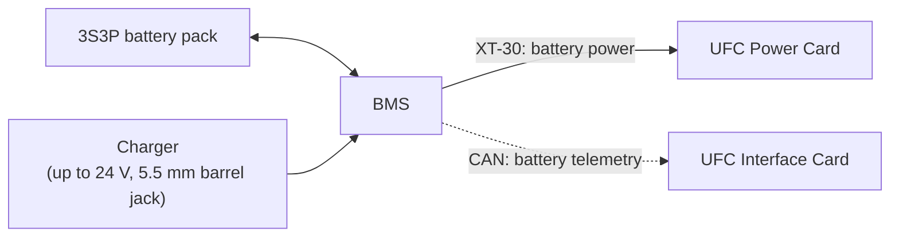

# Battery Management System (BMS)
{: .no_toc }

An all-in-one board for the UFC's battery pack: it monitors, protects, balances, and charges the pack, and reports
live battery data to the UFC over CAN, including during flight.
{: .fs-5 .fw-300 }



Built for
: IREC 2026, as part of UFC 3.5

Where it sits
: Inside the UFC's battery holder

MCU
: STM32G431KBT6

Battery
: 3S pack (the UFC's 3S3P pack)

Connectors
: XT-30 out to the UFC Power Card, 5.5 mm barrel jack for charging, 6-pin CAN to the UFC Interface Card

Design files
: [Altium 365](https://rocket-team.365.altium.com/designs/CCE0C475-3551-4580-961E-E402ACC46341?activeView=SCH&activeDocumentId=BMS20Schematic.SchDoc&variant=[No+Variations]&location=[1,76.94,-223.72,136.32]#design)
{: .facts }

  
Contents

  {: .text-delta }
- TOC
{:toc}

## What it does

- **Monitors** voltage, current, temperature, and the battery's state of health.
- **Protects** against overvoltage, undervoltage, overcurrent, short circuits, overtemperature, overcharge, and
  undercharge.
- **Balances** the cells at the stack level.
- **Charges** the pack from up to 24 V through a barrel jack, with linear charge control. The design goal is a full
  charge in under four hours.
- **Reports** live battery telemetry to the UFC, so we get battery data in flight.



## How it connects

- **Discharge:** an XT-30 connector feeds battery power to the UFC Power Card.
- **Charging:** a 5.5 mm barrel jack.
- **Telemetry:** the STM32 talks to the UFC Interface Card over CAN, through a CAN transceiver and a 6-pin CAN
  connector.
- **Its own power:** a 3.3 V switching regulator on the discharge line powers the STM32.

{: .check }
The BMS uses an **XT-30** for discharge, but the [UFC Power Card]({{ '/docs/projects/ufc/cards/power-card/' | relative_url }})
page says the battery connects through an **XT60**. Presumably there's an adapter cable, but it isn't documented.

## Components

| Part | Part no. | Bus | Notes |
|:--|:--|:--|:--|
| Fuel gauge and protector | [MAX17320G20+](https://www.analog.com/media/en/technical-documentation/data-sheets/max17320.pdf) | SMBus (I2C capable) | 2S–4S. Battery charge and health info, cell balancing with internal FETs. |
| Li-ion charger | [MAX745EAP+](https://www.analog.com/media/en/technical-documentation/data-sheets/MAX745.pdf) | — | Runs standalone. Up to 24 V input, up to 4 A charging current. |
| Microcontroller | [STM32G431KBT6](https://www.st.com/resource/en/datasheet/stm32g431cb.pdf) | CAN, SMBus | 32 pins, 128 KB flash, 3 I2C/SMBus |

### MAX17320 fuel gauge and protector

Monitors the pack's current, voltage, temperature, and state, and protects it against overcurrent and
undercurrent, overtemperature, overvoltage, short circuits, and internal self-discharge. It also balances the three
cell stacks using its internal FETs.

Temperature sensing uses four thermistors:
- two surface-mount thermistors on the MOSFETs
- two thermistors potted inside the housing, on the cells

### MAX745 charger

The charge current is set with resistors, so the charger doesn't need a microcontroller to work. It takes up to 24 V
in through the 5.5 mm barrel jack and charges packs up to 18 V. A surface-mount thermistor monitors the temperature of
the input power control MOSFETs.

### STM32G431 microcontroller

Talks to the MAX17320 over SMBus and sends the BMS data to the UFC Interface Card over CAN. It's powered by the 3.3 V
switching regulator.

## Schematic

Full detail is in [Altium 365](https://rocket-team.365.altium.com/designs/CCE0C475-3551-4580-961E-E402ACC46341?activeView=SCH&activeDocumentId=BMS20Schematic.SchDoc&variant=[No+Variations]&location=[1,76.94,-223.72,136.32]#design).



## PCB

| Layer | Image |
|:--|:--|
| Top | [view ↗](https://github.umn.edu/user-attachments/assets/c179779b-b8ce-4795-a148-9c1153589c38) |
| GND | [view ↗](https://github.umn.edu/user-attachments/assets/df88d0c5-a822-4ff2-94af-dd633a258726) |
| 3.3 V | [view ↗](https://github.umn.edu/user-attachments/assets/46c9e1c5-5ffd-43dc-b31a-da3e781bf220) |
| Bottom | [view ↗](https://github.umn.edu/user-attachments/assets/e1ca568e-c8f5-4ad4-970d-f4ac56ca6b7d) |

Renders: [3D view 1 ↗](https://github.umn.edu/user-attachments/assets/5571a266-d457-4ee3-95ee-28fcc110cbd6) ·
[3D view 2 ↗](https://github.umn.edu/user-attachments/assets/016bd1de-a8fb-4c3e-a3b1-0aa5b2230682)
(image links need a UMN login)

## Firmware

{: .check }
The old wiki marked the BMS firmware as work in progress, and its link pointed at the **Pitot card's** firmware folder
([`Firmware/Pitot_Card`](https://github.umn.edu/Rocket-Team/UFC-2024/tree/main/Firmware/Pitot_Card)), which is
almost certainly a copy-paste mistake. Where the BMS firmware actually lives isn't recorded.

## Requirements

These are the requirements for the EPS (electrical power subsystem), derived with a model-based systems engineering
approach. The BMS was developed specifically for IREC 2026, so the full requirements table, including the parent
requirements, is in the
[IREC 2026 requirements spreadsheet](https://docs.google.com/spreadsheets/d/1ZM7sDWcCKupetqs2eV_MjmVUnbQAa9NKSMUKOIiYPZk/edit?gid=514004948#gid=514004948).



## Testing

Thermal, surge, short-circuit, and hot-case capacity tests are on [BMS Testing]({{ '/docs/projects/bms/testing/' | relative_url }}).
