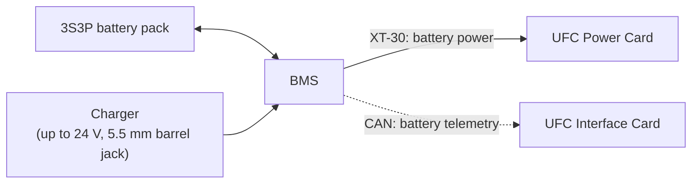

# Battery Management System (BMS)
{: .no_toc }

An all-in-one board for the UFC's battery pack: it monitors, protects, balances, and charges the pack, and reports
live battery data to the UFC over CAN, including during flight.
{: .fs-5 .fw-300 }



Built for
: IREC 2026, as part of UFC 3.5

Where it sits
: Inside the UFC's battery holder

MCU
: STM32G431KBT6 (one PDR slide says STM32L412KBT3; see [December 2025 review](#design-review-december-2025))

Battery
: 3S2P pack of INR-18650-P26A cells (about 12 V nominal)

Connectors
: XT-30 out to the UFC Power Card, 5.5 mm barrel jack for charging, 6-pin CAN to the UFC Interface Card

Design files
: [Altium 365](https://rocket-team.365.altium.com/designs/CCE0C475-3551-4580-961E-E402ACC46341?activeView=SCH&activeDocumentId=BMS20Schematic.SchDoc&variant=[No+Variations]&location=[1,76.94,-223.72,136.32]#design)

Status
: Built in 2025–26 with cell balancing and charging. Getting live battery telemetry to the UFC is a 2026–27 goal (fall 2026 kickoff slides).
{: .facts }

  
Contents

  {: .text-delta }
- TOC
{:toc}

## What it does

- **Monitors** voltage, current, temperature, and the battery's state of health.
- **Protects** against overvoltage, undervoltage, overcurrent, short circuits, overtemperature, overcharge, and
  undercharge.
- **Balances** the cells at the stack level.
- **Charges** the pack from up to 24 V through a barrel jack, with linear charge control. The design goal is a full
  charge in under four hours.
- **Reports** live battery telemetry to the UFC, so we get battery data in flight.

The goal from the design review: "a CAN connected power storage subassembly to provide battery SOC and health
telemetry over the rocket's CAN bus".



## How it connects

- **Discharge:** an XT-30 connector feeds battery power to the UFC Power Card.
- **Charging:** a 5.5 mm barrel jack.
- **Telemetry:** the STM32 talks to the UFC Interface Card over CAN, through a CAN transceiver and a 6-pin CAN
  connector.
- **Its own power:** a 3.3 V switching regulator on the discharge line powers the STM32.

{: .check }
> - The BMS uses an **XT-30** for discharge, but the [UFC Power Card]({{ '/docs/projects/ufc/cards/power-card/' | relative_url }})
>   page says the battery connects through an **XT60**. Presumably there's an adapter cable, but it isn't documented.
> - The 2026 BMS documents (requirements, design review) describe a **3S2P** pack. The older UFC pages
>   ([Power Card]({{ '/docs/projects/ufc/cards/power-card/' | relative_url }}),
>   [Assembly]({{ '/docs/projects/ufc/assembly/' | relative_url }})) say **3S3P**, which was the 2025 pack.

**Energy check.** A 3S2P pack of 2600 mAh, 3.6 V cells stores about 3 × 3.6 V × 2 × 2.6 Ah ≈ **56 Wh** nominal, which
clears the 40 Wh requirement (EPS-2.1) with some margin.

## Components

| Part | Part no. | Bus | Notes |
|:--|:--|:--|:--|
| Fuel gauge and protector | [MAX17320G20+](https://www.analog.com/media/en/technical-documentation/data-sheets/max17320.pdf) | SMBus (I2C capable) | 2S–4S. Battery charge and health info, cell balancing with internal FETs. |
| Li-ion charger | [MAX745EAP+](https://www.analog.com/media/en/technical-documentation/data-sheets/MAX745.pdf) | — | Runs standalone. Up to 24 V input, up to 4 A charging current. |
| Microcontroller | [STM32G431KBT6](https://www.st.com/resource/en/datasheet/stm32g431cb.pdf) | CAN, SMBus | 32 pins, 128 KB flash, 3 I2C/SMBus |

### MAX17320 fuel gauge and protector

Monitors the pack's current, voltage, temperature, and state, and protects it against overcurrent and
undercurrent, overtemperature, overvoltage, short circuits, and internal self-discharge. It also balances the three
cell stacks using its internal FETs.

Temperature sensing uses four thermistors:
- two surface-mount thermistors on the MOSFETs
- two thermistors potted inside the housing, on the cells

### MAX745 charger

The charge current is set with resistors, so the charger doesn't need a microcontroller to work. It takes up to 24 V
in through the 5.5 mm barrel jack and charges packs up to 18 V. A surface-mount thermistor monitors the temperature of
the input power control MOSFETs.

### STM32G431 microcontroller

Talks to the MAX17320 over SMBus and sends the BMS data to the UFC Interface Card over CAN. It's powered by the 3.3 V
switching regulator.

## Schematic

Full detail is in [Altium 365](https://rocket-team.365.altium.com/designs/CCE0C475-3551-4580-961E-E402ACC46341?activeView=SCH&activeDocumentId=BMS20Schematic.SchDoc&variant=[No+Variations]&location=[1,76.94,-223.72,136.32]#design).



## PCB

| Layer | Image |
|:--|:--|
| Top | [view ↗](https://github.umn.edu/user-attachments/assets/c179779b-b8ce-4795-a148-9c1153589c38) |
| GND | [view ↗](https://github.umn.edu/user-attachments/assets/df88d0c5-a822-4ff2-94af-dd633a258726) |
| 3.3 V | [view ↗](https://github.umn.edu/user-attachments/assets/46c9e1c5-5ffd-43dc-b31a-da3e781bf220) |
| Bottom | [view ↗](https://github.umn.edu/user-attachments/assets/e1ca568e-c8f5-4ad4-970d-f4ac56ca6b7d) |

Renders: [3D view 1 ↗](https://github.umn.edu/user-attachments/assets/5571a266-d457-4ee3-95ee-28fcc110cbd6) ·
[3D view 2 ↗](https://github.umn.edu/user-attachments/assets/016bd1de-a8fb-4c3e-a3b1-0aa5b2230682)
(image links need a UMN login)

The PCB has nickel spot-weld pads for the cell tabs, thermistor potting holes, and 18650 spacers holding the cells
(2025–26 PDR).

## Firmware

{: .check }
The old wiki marked the BMS firmware as work in progress, and its link pointed at the **Pitot card's** firmware folder
([`Firmware/Pitot_Card`](https://github.umn.edu/Rocket-Team/UFC-2024/tree/main/Firmware/Pitot_Card)), which is
almost certainly a copy-paste mistake. Where the BMS firmware actually lives isn't recorded.

## Requirements

The EPS (electrical power subsystem) requirements for IREC 2026, derived with a model-based systems engineering
approach. From the team's requirements sheet (`UMNRKT Requirements.xlsx`, "BMS Requirements" tab), where all of them
are marked **Met**. At the December 2025 PDR every one of them was still **Not Met**, so they were closed out
some time in 2026. The full table with parent requirements is also in the
[IREC 2026 requirements spreadsheet](https://docs.google.com/spreadsheets/d/1ZM7sDWcCKupetqs2eV_MjmVUnbQAa9NKSMUKOIiYPZk/edit?gid=514004948#gid=514004948).
How each one was to be verified is on [BMS Testing]({{ '/docs/projects/bms/testing/' | relative_url }}#verification-plan).

| ID | Requirement | Why | Verified by |
|:--|:--|:--|:--|
| EPS-1 | Operate continuously in a **125 °F** ambient temperature | Nose cone temperatures reach upwards of 125 °F in Texas | Test |
| EPS-2 | Power all subsystems for the whole mission | | Analysis |
| EPS-2.1 | Store **40 Wh** | Powers the UFC for about 6 hours | Test |
| EPS-2.2 | Supply the power distribution system a minimum of **11.2 V** | The UFC Power Card needs at least 11 V to run the 3.3 V and 5 V rails | Demonstration |
| EPS-3 | Provide power telemetry to the CDH subsystem (the UFC) | Live power use, state of charge, temperature, and health | Demonstration |
| EPS-3.1 | Report state of charge at **≥ 10 Hz** | Go/no-go launch decisions and in-flight telemetry | Demonstration |
| EPS-3.2 | Report the power leaving the pack at **≥ 10 Hz** | Spot a short circuit or abnormal draw | Demonstration |
| EPS-3.3 | Talk to the CDH subsystem over **CAN** | The UFC uses CAN between boards | Demonstration |
| EPS-4 | Charge from empty to full in **≤ 4 hours** | Long charge times would hold up pre-launch integration at IREC | Analysis |

{: .check }
> - **Minimum voltage.** The requirements sheet says EPS-2.2 is 11.2 V, but the verification matrix says 7.5 V
>   ("verified through 3S2P configuration, min cell voltage of 2.5 V"). The [Power Card]({{ '/docs/projects/ufc/cards/power-card/' | relative_url }})
>   page's undervoltage lockout (about 6.5 V) doesn't match "needs at least 11 V" either.
> - **Telemetry.** EPS-3 is marked Met, but the fall 2026 kickoff lists live BMS telemetry as a goal for this year.



## Design review (August 2025)

The BMS had its conceptual design review (CoDR) on **27 August 2025**. The slides and reviewer notes are in the team
Drive (09-Internal Design Reviews › 2026 Battery Management System).

### Concept

- **Block diagram:** STM32 with an interlock/arming circuit, the BMS IC, protection circuitry, thermistors, and the
  cell pack.
- **Arming:** an interconnect circuit enables the STM32 when the battery is plugged into the UFC Power Card. The EN+/EN−
  lines are high impedance and current limited.
- **Enclosure:** acetal or aluminum, with a mounting flange on ¼-20 socket head cap screws, one outlet for power and data
  wires, 18650 spacers holding the cells, and possibly epoxy potting.

### Trade studies

Each part was chosen with a weighted trade study (the method is in
[Systems Engineering]({{ '/docs/tutorials/systems-engineering/' | relative_url }}#trade-studies)). Scores are out of 1.

| Choice | Options (score) | Picked |
|:--|:--|:--|
| BMS IC | **BQ40Z50** (0.95), MAX17320 (0.91), BQ3060 (0.76) | BQ40Z50 at review; the board uses the **MAX17320** (see below) |
| Charger IC | MAX745, MP2759, LTC4006 (all 0.83), BQ24130 and BQ24170 (0.76), BQ2954 (0.56) | **MAX745** |
| Cells | **INR-18650-P26A** (0.85), EVE 25P (0.79), INR18650-30Q (0.76), EVE ICR18650 (0.71) | **INR-18650-P26A**: 2600 mAh, 35 A continuous, 3.6 V nominal, 45.8 g |
| Thermistors | **NRL1104F3950B1F** (1.00), 103AT-4-70374 and NTCLE413E2103F106A (0.95), BN35-3H103FB-50 (0.88) | **NRL1104F3950B1F**: 10 kΩ NTC epoxy bead, 1%, −40 to 125 °C |
| N-channel MOSFETs | **CSD17551Q3A** (0.76), CSD17318Q2 (0.75), CSD17308Q3 (0.68, the BMS datasheet's suggestion), CSD17571Q2 (0.53), CSD17313Q2T (0.46) | Not recorded |

A few details worth knowing:

- The BMS IC criteria were weighted by pairwise comparison, with four people ranking every criterion against every
  other and the results averaged. Thermal protection and overcurrent protection came out on top; cost and pin count at
  the bottom.
- 2S/3S compatibility was a criterion because the Pitot system runs on 2S and the UFC on 3S, so one chip could serve
  both.
- The cell trade study scored capacity and continuous discharge rate at 30% each, weight and cost at 20% each.
- The MOSFET study sized parts for **at least twice** the expected 4 A maximum draw, with junction temperatures
  estimated at 5 A.

{: .check }
The review slides and trade study pick the TI **BQ40Z50**, but the board as built (and as described above) uses the
Analog Devices **MAX17320**, which came a close second (0.91 vs 0.95). The reason for the switch isn't written down.
Which MOSFETs were fitted isn't recorded either.

### Reviewer feedback

From the review notes. Worth reading before the next BMS revision:

- **Schematic:** keep the button; remove the 0 Ω resistors in front of the LEDs; Q5 needs to be grounded. Reversing the
  pack polarity could blow Q4's gate, so add a Zener or other clamp diode. Replace the chemical fuse with a normal one,
  given the tripping problems ("don't want to blow up the rocket on the pad").
- **Pre-charge:** the pre-charge FET is there because Li-ion cells shouldn't be charged quickly when they're fully
  depleted, and deeply discharged cells may not be chargeable at all.
- **Thermistors:** they matter more for charging than discharging. Put them around the cells and the power
  electronics, electrically isolated, with copper planes to conduct heat to them. They're slow, so test their response,
  and check hot spots with an IR camera.
- **Enclosure:** an aluminum exterior; double-sided silicone tape or Kapton to fit the cells; 18650 spacers work well
  to make a solid brick. Protect wire exits from rubbing, check wire bend radius, and use RTV or caulk so nothing
  can move under shock and vibration.
- **Cell monitoring:** the BMS IC balances each parallel group and only sees group voltages, so it can't pick out a
  single bad cell. Its lifetime monitoring may show that something looks off.
- **Power and architecture:** look at the STM32's ultra-low-voltage features and wake-up schemes. The last discussion
  point in the notes was keeping the power electronics external, with a handshake to the UFC.

## Design review (December 2025)

The BMS was part of the avionics PDR on **4 December 2025**. By then the board used the MAX17320 (the reason for the
switch from the BQ40Z50 still isn't written down), and the pack was sized at **40 Wh for 6 hours** of runtime, all
hard-cased Li-ion cells. The test profiles it presented are on
[BMS Testing]({{ '/docs/projects/bms/testing/' | relative_url }}#test-profiles).

**Charging math**, as presented:

- Each cell is 3000 mAh, so the 3S2P pack is 6000 mAh.
- The rule of thumb is to charge at about half the capacity, so 3 A. Upsized to **3.7 A** for a charge time of 1.6 hours.
- The MAX745 datasheet sets the full-scale charge current as IFS = 137 mV / R1, which gives a **50 mΩ** set
  resistor.

{: .check }
> Three things in the PDR slides don't line up with the rest of the BMS docs:
>
> - **Cell capacity.** The charging math uses 3000 mAh cells. The chosen INR-18650-P26A is 2600 mAh (the CoDR trade
>   study above), so the pack is 5200 mAh, not 6000.
> - **Charge current.** With the MAX745's equation, 137 mV / 50 mΩ = **2.74 A**, not 3.7 A. Getting 3.7 A would take
>   about 37 mΩ. At 2.74 A a 5.2 Ah pack takes roughly 1.9 hours, which still meets EPS-4 (4 hours). Check which
>   resistor is on the board.
> - **Microcontroller.** The overview and PCB slides say STM32G431, but the microcontroller slide describes an
>   **STM32L412KBT3** (Cortex-M4 at 80 MHz, 32 pins, 128 KB flash, one CAN-FD interface). The old wiki and the board
>   use the G431, and that slide's CAN-FD line fits the G431 better, so it's probably a leftover from an earlier trade.

**Questions from the review:**

- *Why 4 hours of recovery in the 6-hour budget?* The numbers came from asking previous IREC leads; the team couldn't
  justify 4 hours specifically. The UFC stops transmitting once it's landed, so the draw does drop. Another reviewer
  pointed out that recovery can take 8+ hours for reasons outside the team's control. The action item: work out run
  times for about 1.5 hours of recovery, and what a smaller **3S1P** pack would give.
- *What's running on the boards during environmental tests?* The boards run in the states they'd be in during the
  mission, with live data plotted against red and orange limit lines. The action item was to write test plans with
  pass/fail criteria.

**Changes after the review** (from the PDR action item list, all marked done):

- The CAN connector got in the way of the battery's mechanical mounting, so it became a **right-angle 6-pin JST**
  (there was no right-angle version of the original CAN connector).
- Power planes instead of thin traces on the high-power paths.
- A new **L1** rated for the current (the old one wasn't).
- Different surface-mount thermistors.
- Test points added, vias tented, the net-tie footprint removed, and a notch cut for the programmer connector.

## Testing

Thermal, surge, short-circuit, and hot-case capacity tests are on [BMS Testing]({{ '/docs/projects/bms/testing/' | relative_url }}).
