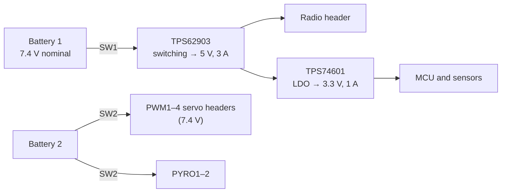

# G.Y.R.O
{: .no_toc }

A standalone, single-board flight computer that runs roll control onboard. Built for the 2025–26 Midwest
competition, with extra hardware (spare servo outputs, pyro channels) for future projects.
{: .fs-5 .fw-300 }



Built for
: Midwest 2026 (2025–26 season)

Board revision
: v2.0

MCU
: STM32H730VBT6

Design files
: [Altium 365](https://rocket-team.365.altium.com/designs/E1BDA5FC-61E6-4C7B-8803-524813A81FF4)

Code
: [`Avionics/Midwest`](https://github.umn.edu/Rocket-Team/Avionics/tree/main/Midwest) (Simulink models and firmware)

Pinout
: [Pinout spreadsheet](https://docs.google.com/spreadsheets/d/1Z5J-wmHlZrJ90PHBylzzkdYmuIe1y-qd6sn0RwVBkjI/edit?usp=sharing)
{: .facts }

<details open markdown="block">
  <summary>Contents</summary>
  {: .text-delta }
- TOC
{:toc}
</details>

---

## Overview

GYRO senses the rocket's roll, runs a roll control algorithm, and drives a servo to control it. It has the same
core parts as a UFC data card:

- **Sensors:** a BNO055 IMU (3-axis gyroscope, 3-axis accelerometer, and 3-axis magnetometer for absolute
  orientation), a BMP390 barometer/thermometer, and a low-power MAX-M10S GPS.
- **Storage and telemetry:** everything is saved to on-board flash, then sent to the ground over an off-board RFD900
  radio and written to an SD card. Like the UFC cards, flash recording is triggered by detecting takeoff and landing
  (using the BNO055), and the flash can only be erased with a terminal command.
- **Actuation:** four PWM headers for servos. One drives roll control; the other three are spares for the future.
- **Pyro:** two pyro channels. They aren't used for Midwest but are there for future projects.
- **Extras:** status LEDs, programmer and debug pins, a buzzer, and two outputs for external LEDs (for Midwest's roll
  control indication challenge).

A lot of the base firmware comes from the [UFC]({{ '/docs/projects/ufc/' | relative_url }}).



## Requirements

These are the requirements for the CDH (command and data handling) and EPS (electrical power) subsystems, derived with a
model-based systems engineering approach using the
[system characterization tool](https://docs.google.com/spreadsheets/d/1J1WzmcqXW74kMw2ttB3k-ih3p1dvYtJIzfMMIMCmOSo/edit?gid=567000003#gid=567000003).
GYRO was built specifically for Midwest 2026, so the full requirements table, including parent requirements, is in the
[Midwest requirements spreadsheet](https://docs.google.com/spreadsheets/d/164qZIYZoGh1ZgoEiZHAX8oQplVZ39T5lwZK8q8euXJw/edit?gid=1230869352#gid=1230869352).



## Connections

| Connector | Type | Notes |
|:--|:--|:--|
| Battery 1 | Power | Powers the MCU and sensors. 10 A max. |
| Battery 2 | Power | Powers the servos and pyro channels directly. 10 A max. |
| SW1 | Switch | Enables Battery 1 (see the warning below). 6 A max. |
| SW2 | Switch | Enables Battery 2 (see the warning below). 6 A max. |
| PWM1–4 | PWM | Each on an STM32 timer channel, for servos. Supplies 7.4 V, 2 A max. |
| CAM | UART | Alternate function of PWM1 (TX) and PWM2 (RX), for controlling a camera over UART. |
| Radio | UART, RTS/CTS | For the external radio. Supplies 5 V, 1 A max. |
| PYRO1–2 | — | Pyro charge outputs, switched by a MOSFET driven by PWM. 6 A max. |
| P1 / P2 | GPIO | External LEDs, for the Midwest roll control indication challenge. The current-limiting resistors are already on the board. |

{: .warning }
The old docs say to "connect the power and ground together" on SW1/SW2 to enable each battery. Taken literally that's a
short circuit, so it almost certainly means bridging the switch header's two terminals. **Check the schematic before
wiring a switch** so you know exactly what it connects.

## Power

GYRO runs from **two separate batteries**: Battery 1 for the logic (MCU, sensors, radio) and Battery 2 for the
servos and pyro channels.



- **5 V (TPS62903 switching regulator):** takes the nominal 7.4 V straight from Battery 1 and supplies up to 3 A
  continuous. Feeds the radio and the 3.3 V regulator. Output voltage is set by a single resistor on the FB pin
  (internal divider). A resistor on the MODE pin sets 2.5 MHz switching, enables output discharge, and picks the PWM
  efficiency mode. Output goes through decoupling caps and a fuse, and its PowerGood drives an LED.
- **3.3 V (TPS74601 LDO):** set to 3.3 V with an external divider on FB, up to 1 A. Powers the microcontroller and
  sensors, through more decoupling and a fuse. PowerGood drives an LED.



| Part | Part no. | Input | Notes |
|:--|:--|:--|:--|
| 5.0 V switching regulator | [TPS62903RPJR](https://www.digikey.com/en/products/detail/texas-instruments/TPS62903RPJR/14004434) | 3–17 V | Adjustable output 0.4–5.5 V, up to 3 A |
| 3.3 V linear regulator | [TPS74601PDRVT](https://www.digikey.com/en/products/detail/texas-instruments/TPS74601PDRVT/9860757) | | Adjustable output 0.55–5.5 V (per old docs), up to 1 A |
| LEDs | [150060VS75000](https://www.digikey.com/en/products/detail/w%C3%BCrth-elektronik/150060VS75000/4489906) (green), [150060BS75000](https://www.digikey.com/en/products/detail/w%C3%BCrth-elektronik/150060BS75000/4489895) (blue) | | Regulator PowerGood indicators |

{: .check }
The old docs disagree on the TPS74601's dropout: the table says 1.05 V max at 1 A, the text says 225 mV max at 1 A.
Either works with 5 V in and 3.3 V out, but check the datasheet before reusing this regulator elsewhere.

## Components

| Part | Part no. | Bus | Notes |
|:--|:--|:--|:--|
| Microcontroller | [STM32H730VBT6](https://www.digikey.com/en/products/detail/stmicroelectronics/STM32H730VBT6/13171210) | UART, I2C, SPI | Talks to its parts over UART7 and I2C4 |
| Flash | [W25N512GV](https://www.winbond.com/resource-files/w25n512gv%20rev%20c%20112118.pdf) | QUADSPI | 64 MB NAND |
| SD card slot | [MEM2075-00-140-01-A](https://www.digikey.com/en/products/detail/gct/MEM2075-00-140-01-A/9859614) | SPI | Micro SD, card-detect pin to GPIO |
| 9-axis IMU | [BNO055](https://cdn-shop.adafruit.com/datasheets/BST_BNO055_DS000_12.pdf) | I2C | Address 0x28, INT1 |
| Barometer/thermometer | [BMP390](https://www.bosch-sensortec.com/media/boschsensortec/downloads/datasheets/bst-bmp390-ds002.pdf) | I2C | Address 0x76, INT |
| GPS | [MAX-M10S-00B](https://www.digikey.com/en/products/detail/u-blox/MAX-M10S-00B/15712906) | I2C | 400 kHz, GPS_INT |
| Radio (off-board) | [RFD900ux](https://files.rfdesign.com.au/Files/documents/RFD900ux%20DataSheet%20V1.0.pdf) | UART, RTS/CTS | 902–928 MHz FHSS, 30 dBm (1 W) max, 64 kbps default air rate (224 kbps max), rated 40+ km |
| Buzzer | [PS1440P02BT](https://www.digikey.com/en/products/detail/tdk-corporation/PS1440P02BT/2236828) | GPIO/PWM | Common-emitter driver |
| Servo | [REEFS207 (49Sub Micro Servo)](https://reefsrc.com/products/49sub-micro-servo-reefs207) | PPM | 3-pin, 4.8–8.4 V, 180° ± 10°, −15 to +70 °C |
| LEDs | Red, green, blue, yellow (Würth 150060 series) | GPIO | |

The IMU, barometer, GPS, and buzzer are wired the same way as on the UFC Primary and Interface cards; details are in the
[Parts Reference]({{ '/docs/projects/parts-reference/' | relative_url }}).

**Radio.** For Midwest, the RFD900 sits off the board and connects through the external radio header. Like the UFC
Primary Card, its 5 V input goes through an 1100 mA resettable fuse and a 0 Ω jumper, because an RFD once damaged an
STM32. The RFD peaks at about 1 A, so 1100 mA leaves some headroom before it trips by accident.

## Schematic

Full detail is in [Altium 365](https://rocket-team.365.altium.com/designs/E1BDA5FC-61E6-4C7B-8803-524813A81FF4).



## PCB

| Layer | Pour | Routing | Image |
|:--|:--|:--|:--|
| Top | GND (only to shield the GPS RF signal) | Signals | [view ↗](https://github.umn.edu/user-attachments/assets/07397f94-de92-4106-bfe3-02ba1c035109) |
| Mid 1 | GND plane | None | [view ↗](https://github.umn.edu/user-attachments/assets/9e01ab15-e935-4be9-bf1a-0a4f6351d78c) |
| Mid 2 | 3.3 V plane | None | [view ↗](https://github.umn.edu/user-attachments/assets/47240721-a946-41cb-9888-0d76d652027c) |
| Bottom | Two separate pours: 7.4 V and 5 V | Signals | [view ↗](https://github.umn.edu/user-attachments/assets/33af74c7-6e7a-4ae0-8e45-4e63bd8cdf59) |

Renders: [3D front ↗](https://github.umn.edu/user-attachments/assets/8c92538f-ff16-4588-88cc-0796720c4663) ·
[3D back ↗](https://github.umn.edu/user-attachments/assets/0f088cc9-e526-4a34-ae14-26c9cb8f3dce) ·
[2D view ↗](https://github.umn.edu/user-attachments/assets/78fbc951-700f-4183-9a43-db0c5b78cbfd)
(image links need a UMN login)

## Revisions

**v2.0** fixed these problems from v1.0:

- RX and TX were swapped on both the GPS and the radio.
- The MOSFET schematic symbol had the wrong pin order, so source and drain were swapped.
- The serial number and "QA Passed" silkscreen were moved so vias don't poke through them.

**For a future revision:** consider switching the GPS to a u-blox SAM-M10Q, which has a built-in antenna and would be
easier to integrate.

## GNC and firmware

GYRO follows a **model-based design** workflow: the control algorithms are built and validated in Simulink, then
implemented in the embedded firmware on the board.

```text
Midwest/
├── Simulink/           # Simulink model and control algorithm
│   ├── models/         # Control system and plant models
│   └── simulations/    # Test scenarios and simulation setups
├── Firmware/           # Embedded firmware
│   ├── Core/           # Core logic, like the terminal and packet structure
│   ├── Midwest_card/   # Peripheral drivers, auto-generated code, and main
│   └── STMGenerated/   # HAL
└── README.md
```

{: .check }
The old firmware page had placeholders for the system architecture, the Simulink model, testing and validation (including
test flights), and future work. None of them were filled in. The roll model and controller in particular aren't
documented anywhere yet.

If you're new to roll control, weeks 2 and 3 of the [GNC Crash Course]({{ '/docs/tutorials/gnc/crash-course/' | relative_url }})
build a simplified roll model and a roll-rate controller in Simulink. That's a good primer, though it isn't GYRO's
actual model.
