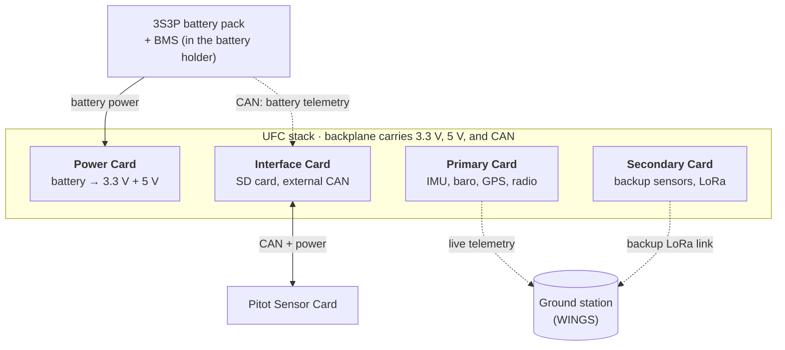

# System Architecture
{: .no_toc }

How the UFC's cards, backplane, and outside systems connect, and the structure that holds it all together.
{: .fs-5 .fw-300 }

  
Contents

  {: .text-delta }
- TOC
{:toc}

---

## The short version

The UFC splits the jobs of a flight computer across **four cards** (2.50 × 2.55 in each) that stack
vertically and plug into a **backplane**, a motherboard-style PCB that runs perpendicular to the stack.
The backplane carries the 3.3 V and 5 V rails from the Power Card and a shared **CAN bus**. Every card
except the Power Card has its own STM32H730 microcontroller, its own flash chip, and its own firmware, so
each one can do its job without the others.

## The cards

| Card | Job | MCU |
|:--|:--|:--|
| [Power Card]({{ '/docs/projects/ufc/cards/power-card/' | relative_url }}) | Takes battery power and regulates it (two stages) into the 3.3 V and 5 V rails. Also holds the CAN termination switch. | None |
| [Primary Card]({{ '/docs/projects/ufc/cards/primary-card/' | relative_url }}) | Main sensors (9-axis IMU, barometer/thermometer), GPS, and the primary radio. | STM32H730 |
| [Secondary Card]({{ '/docs/projects/ufc/cards/secondary-card/' | relative_url }}) | Redundant copy of the Primary Card's measurements using mostly different parts, a backup LoRa radio, and no GPS. | STM32H730 |
| [Interface Card]({{ '/docs/projects/ufc/cards/interface-card/' | relative_url }}) | Collects data from the other cards onto an SD card, and has connectors for systems outside the stack. | STM32H730 |

The Primary and Secondary cards overlap on purpose. Having two cards that measure the same things means we
can fully test and fly one before the other is finished. [Design History]({{ '/docs/projects/ufc/design-history/' | relative_url }}#2024-25-ufc3)
has the reasoning.

Other boards that belong to the UFC system:

- **[Backplane]({{ '/docs/projects/ufc/cards/backplane/' | relative_url }})**: four PCIe card slots, carrying power and CAN to every card.
- **[Pitot Sensor Card and Pitot Power Card]({{ '/docs/projects/pitot/' | relative_url }})**: the pressure sensors in the nose cone tip. The sensor card can be powered and talked to through the Interface Card, or run from its own power card.
- **[Battery Management System]({{ '/docs/projects/bms/' | relative_url }})**: monitors and protects the battery pack, and reports battery data to the Interface Card over CAN.
- **Debugger board**: never flown. It breaks each card's debug lines out to header pins so you can hook up a logic analyzer. See [Programming and debugging]({{ '/docs/projects/ufc/cards/' | relative_url }}#programming-and-debugging).





## How data moves

Every card with a microcontroller deals with four kinds of connection:

| Connection | Protocol | Used for |
|:--|:--|:--|
| Sensors → MCU | SPI, I2C, UART | Reading sensors and the GPS |
| Card ↔ card | CAN, over the backplane | Requests, commands, and data between cards. Always one card talking to one other card, never broadcast. See [CAN Protocol]({{ '/docs/projects/ufc/firmware/can-protocol/' | relative_url }}). |
| MCU → storage and radios | QUADSPI (flash), SPI (SD card), UART (radios) | Logging data and sending telemetry |
| MCU ↔ outside world | UART through the programmer pins | Programming the card, and the [terminal]({{ '/docs/projects/ufc/firmware/terminal/' | relative_url }}) for status, commands, and readout |

### Where the flight data ends up

1. Each data card writes its own data to its own flash chip. Recording starts when that card's state
   detection decides the rocket has launched. A circular buffer in RAM keeps roughly the last 10 seconds
   before that, so the launch itself isn't lost. The details are on the [Flash Driver]({{ '/docs/projects/ufc/firmware/flash-driver/' | relative_url }}) page.
2. Live telemetry goes to WINGS over the Primary Card's radio at the same time.
3. The Interface Card pulls each card's flash contents over CAN and saves them to the SD card, either during
   or after the flight. CAN between cards is faster than reading each flash chip out over UART.
4. After recovery, the SD card should have everything. [Flight Operations]({{ '/docs/projects/ufc/operations/' | relative_url }}#after-the-flight)
   covers what to do if it doesn't.

## Structure

The structure has to fit different airframes and survive the loads of different flight profiles. The main
things we trade off are total weight, total length, the smallest body tube it fits in, how much load it can
take, and how it mounts to the rocket.



### Current structure (2026)

For the IREC 2026 rocket the structure was shortened from 8 card slots to 4 to save space. The battery
cell holder was also made smaller, and the new [BMS]({{ '/docs/projects/bms/' | relative_url }}) board lives
inside it. Otherwise the materials and layout are the same as the 2025 structure.

### Materials

- **G10 fiberglass** makes up most of the structure (the older structures were aluminum). Aluminum is easier
  to machine and can be tapped, but G10 has a better strength-to-weight ratio. It's also RF transparent, so it
  doesn't block signals from commercial recovery computers, trackers, or the UFC's own antennas.
- Laminated composites are weaker than metal in **bending and buckling**. The sleds are most affected, so
  they get a spine of structural epoxy.
- **7075-T6 aluminum standoffs** sit midway up the structure between the sleds for extra bending and
  buckling stiffness. All the L-brackets are 7075-T6 as well. 7075-T6 has the best strength-to-weight of the
  aluminum alloys we can easily get, and aluminum beats steel on weight.

### How it got here

| Years | Structure |
|:--|:--|
| 2019–2024 | Two parallel aluminum rails with milled channels that the cards slot into, held in with bolts and L-brackets so vibration can't back them out of their connectors. It was supposed to fit a 4 in airframe but didn't: the backplane thickness wasn't accounted for, and the card interface was off-center from the rocket's axis. That was fine while it only flew in the big SAC/IREC rockets. |
| 2025 | Redesigned to cut weight and actually fit smaller test rockets, and made easier to integrate with more ways to mount it. Switched to G10 and 7075-T6 (above). |
| 2026 | Cut down to 4 cards, with a smaller battery holder that contains the BMS. |




