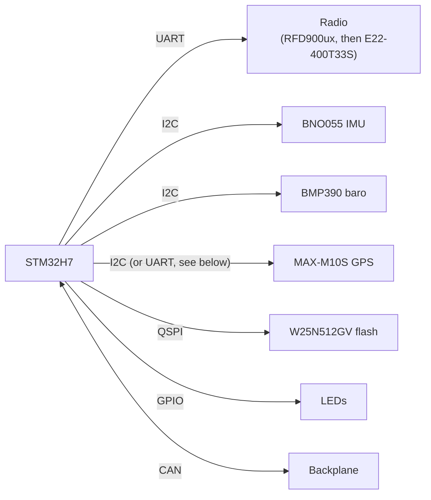

# Primary Card
{: .no_toc }

The main sensor and telemetry card: a 9-axis IMU, a barometer/thermometer, the UFC's only GPS, and the
primary radio. It logs everything to its own flash and sends live telemetry to the ground.
{: .fs-5 .fw-300 }

CARD_TYPE
: 4 (also the default CARD_ID)

MCU
: STM32H730VBT6, talking to its parts over UART7 and I2C3, and to the backplane over CAN

Flash
: W25N512GV, 64 MB NAND over QUADSPI

Radio
: EBYTE E22-400T33S LoRa, 433 MHz, from 2025–26. An RFD900ux (902–928 MHz) before that. See [Radio](#radio).

Firmware
: [`Firmware/Primary_Card`](https://github.umn.edu/Rocket-Team/UFC-2024/tree/main/Firmware/Primary_Card)
{: .facts }

  
Contents

  {: .text-delta }
- TOC
{:toc}

## Purpose

The Primary Card collects and stores sensor data, sends telemetry to the ground station, and does light
processing like converting raw readings into real units. All data is saved to the on-board flash as well as
being sent over the radio. Recording to flash starts when the card's state detection sees a launch (see
[Flash Driver]({{ '/docs/projects/ufc/firmware/flash-driver/' | relative_url }})).

Sensors:

- **IMU (BNO055)**: 3-axis gyroscope, 3-axis accelerometer, and a 3-axis magnetometer for absolute orientation
- **Barometer/thermometer (BMP390)**
- **GPS (MAX-M10S)**: low power, used for recovery

Redrawn from `Data Card 1 Block Diagram` in the team Drive (`03-Avionics IREC/Diagrams`), which also marks the RFD
and GPS antenna connectors. The old wiki's version is below.



## Components

| Part | Part no. | Bus | Notes |
|:--|:--|:--|:--|
| Microcontroller | [STM32H730VBT6](https://www.digikey.com/en/products/detail/stmicroelectronics/STM32H730VBT6/13171210) | UART, I2C, CAN | 100 pin, 550 MHz, 128 KB flash |
| Flash | [W25N512GV](https://www.winbond.com/resource-files/w25n512gv%20rev%20c%20112118.pdf) | QUADSPI | 64 MB NAND |
| 9-axis IMU | [BNO055](https://cdn-shop.adafruit.com/datasheets/BST_BNO055_DS000_12.pdf) | I2C | Fused orientation output (quaternion) |
| Barometer/thermometer | [BMP390](https://www.bosch-sensortec.com/media/boschsensortec/downloads/datasheets/bst-bmp390-ds002.pdf) | I2C | 30–125 kPa, −40–85 °C, up to 200 Hz |
| GPS | [MAX-M10S-00B](https://www.digikey.com/en/products/detail/u-blox/MAX-M10S-00B/15712906) | I2C | Up to 20 Hz updates |
| Radio (2025–26 on, per card spec) | [E22-400T22S](https://use.365.altium.com/librarycomponentsapi/api/v1/References/1A5364BB-2399-40E0-B04A-82A08AA792DD) | UART, RTS/CTS | LoRa, 410–493 MHz (default 433.125 MHz), 22 dBm max, ~5 km |
| Radio (2024–25) | [RFD900UX2](https://files.rfdesign.com.au/Files/documents/RFD900ux%20DataSheet%20v1.2.pdf) | UART | 902–928 MHz FHSS |
| LEDs | [Red](https://www.digikey.com/en/products/detail/w%C3%BCrth-elektronik/150060RS75000/4489901), [green](https://www.digikey.com/en/products/detail/w%C3%BCrth-elektronik/150060VS75000/4489906), [blue](https://www.digikey.com/en/products/detail/w%C3%BCrth-elektronik/150060BS75000/4489895), yellow (150060YS75000) | GPIO | Würth 150060 series |

Specs, datasheets, and general notes for the shared parts (MCU, flash, BNO055, BMP390, GPS, radios) are on
the [Parts Reference]({{ '/docs/projects/parts-reference/' | relative_url }}).

## Wiring notes

| Part | Bus details | Interrupts | Other |
|:--|:--|:--|:--|
| BNO055 | I2C, address **0x28** (COM3 low) | INT1 | |
| BMP390 | I2C, address **0x76** (SDO low) | INT | CSB tied to power to select I2C, SDO grounded |
| MAX-M10S | I2C at 400 kHz, timing register value `0x00B03BCD` (see note) | GPS_INT | TVS diode for ESD and an RLC filter on the RF input |
| Radio | UART with RTS/CTS | | 1100 mA resettable fuse and a 0 Ω jumper on its 5 V input (below) |
| Flash | QUADSPI | | Same flash circuit as every other UFC card |

{: .check }
The `UFC-2024 Pin Allocations` sheet in the team Drive (the "CURRENT" tab) puts the GPS on **UART4** (PB9 TX, PB8 RX),
not I2C. The same sheet has the radio on UART7 (PE8/PE7) and the I2C3 bus on PA8/PC9. The firmware timing sheet
also gives the Primary Card's I2C bus as 1000 kHz rather than 400 kHz. Check the schematic and `GPS_Driver.h` to see
which bus the GPS really uses.

**Why the radio fuse.** An RFD damaged an STM32 the year before this card was designed, so its 5 V input now
goes through a 1100 mA resettable fuse (with a 0 Ω jumper). The RFD peaks at about 1 A, so 1100 mA leaves some
headroom before it trips by accident.

## Radio

The Primary Card carries the UFC's high-rate telemetry radio. Which radio that is depends on the year:

| Years | Radio | Band | Notes |
|:--|:--|:--|:--|
| 2024–25 (flew at IREC 2025) | RFD900ux | 902–928 MHz, frequency hopping | What the firmware, the April 2025 overnight test, and [Flight Operations]({{ '/docs/projects/ufc/operations/' | relative_url }}) describe |
| 2025–26 on | EBYTE E22-400T33S | 433 MHz LoRa | Chosen for UFC 3.5 |

**Why it changed.** New IREC rules for 2026 don't allow frequency hopping, which most telemetry radios (the RFD
included) rely on, and the team decided to stay in the 433 MHz band under 200 mW. The E22 is a one-for-one swap on
the Primary Card. The Secondary Card's LoRa already complied, so the plan at the December 2025 PDR was two 433 MHz
LoRa radios: one for data and one for commands. Whether LoRa's chirp spread spectrum counts as allowed wasn't
confirmed by the competition at the time; the team's reasoning was that another spread-spectrum band is allowed.

From the 2025–26 PDR:

E22-400T33S
: 2 W max transmit power, set to 200 mW for IREC. UART interface. −128 dBm receiver sensitivity at 2.4 kbps.

Data rate needed
: 102.4 kbps: a 640-byte frame (16-byte header, 8–404 bytes of data, 4-byte footer) at 20 Hz. The E22 scored 0.5 on
  data rate in the trade study below, and one PDR action item is to shrink the GPS packet and lower packet rates for
  "this year's lower telemetry radio".

Link budget at 10 km
: 22.3 dB margin, assuming 22 dBm out, a 2 dBi antenna on the rocket, a 12 dBi antenna on the ground, −95 dBm receiver
  sensitivity, and 4.5 dB of losses. The same calculation for the RN2483 gave 13.2 dB.

Antenna connectors
: MCX. SMA was too big and U.FL was unreliable. A reviewer suggested looking at SMP.
{: .facts }

At PDR, the E22 schematic and layout weren't done, and there was no 433 MHz Yagi for the ground station yet. The
component table below has both radios; the one in the card spec is the E22-400**T22S** (22 dBm), not the T33S (33 dBm,
2 W). Check the UFC 3.5 schematic for the part actually fitted.

### Radio trade study (2026)

From the UFC 3.5 design review (`433 Mhz Radio Trade Study.xlsx`). Operating at 433 MHz was a pass/fail
requirement; the rest were weighted scores.

| | RFD900ux | SiK telemetry radio (1 W) | E19-433M30S | **E22-400T33S** |
|:--|:-:|:-:|:-:|:-:|
| Modulation | FHSS | FHSS | LoRa | LoRa |
| Works at 433 MHz (required) | No | Yes | Yes | Yes |
| Air data rate (45%) | 1.0 | 0.95 | 0.25 | 0.5 |
| TX power consumption (20%) | 0.0 | 0.1 | 0.4 | 0.0 |
| Transmit power (20%) | 0.5 | 0.5 | 0.5 | 1.0 |
| **Weighted total** | 0.55 | 0.55 | 0.37 | **0.58** |

The sheet also has a 15% "UART interface" criterion (the current comms firmware uses UART) that isn't counted in
the totals, which is why the weights only add up to 85%. Its data-rate scale assumes 2025 flew at 60 kbps and that
about 102 kbps would be ideal.

## Sensor settings

How the firmware configures each sensor, from the firmware subteam's `UFC Sensor Range, ODR, Modes` notes
(written around the end of 2024). "Measured" is the rate they actually saw.

| Sensor | Range | Output rate | Notes |
|:--|:--|:--|:--|
| BNO055 | ±16 g | 100 Hz (about 90 Hz measured) | |
| MAX-M10S GPS | — | 10 Hz | UBX messages only. See the [integration manual](https://content.u-blox.com/sites/default/files/MAX-M10S_IntegrationManual_UBX-20053088.pdf) and [interface description](https://content.u-blox.com/sites/default/files/u-blox-M10-SPG-5.10_InterfaceDescription_UBX-21035062.pdf). |
| BMP390 | 300–1100 hPa, 0–65 °C | Not finalised | Set to the highest pressure resolution (21-bit) with 2× temperature oversampling (17-bit). The trade-off: about 200 samples/s at the lowest resolution (nearest 0.76 ft of altitude) versus about 14 samples/s at 32× oversampling (nearest 0.28 in). |

The BMP390 bottoms out at 300 hPa, roughly 30,000 ft, which is why the 2025–26 vacuum test stops there. At that PDR a
reviewer suggested the MS5611, which a lot of COTS altimeters use and which is good to 100,000 ft. Nobody had decided
whether it's worth switching (or writing a driver for it) as of the PDR action items.

Timing numbers for the whole card (loop rate, data rate, flash fill time) are on
[Timings & Budgets]({{ '/docs/projects/ufc/firmware/timings/' | relative_url }}).

## Schematic



## PCB

| Layer | Pour | Routing | Image |
|:--|:--|:--|:--|
| Top | GND | Signals | [view ↗](https://github.umn.edu/Rocket-Team/UFC-2024/assets/23053/de783217-8c1c-4cdd-ae2d-811584a523ee) |
| Mid 1 | GND | None | [view ↗](https://github.umn.edu/Rocket-Team/UFC-2024/assets/23053/273ef8d2-03f1-4232-a7a9-d73d11cc5acf) |
| Mid 2 | 3.3 V | Minimal | [view ↗](https://github.umn.edu/Rocket-Team/UFC-2024/assets/23053/7c68ff19-0356-471d-b69e-21dd262cf66f) |
| Bottom | GND | Signals | [view ↗](https://github.umn.edu/Rocket-Team/UFC-2024/assets/23053/7e6c38ee-a170-471e-ab79-af9cbdc3d9b0) |

Renders: [3D view ↗](https://github.umn.edu/Rocket-Team/UFC-2024/assets/23053/cb3f3594-fbdb-485d-a6cd-e56a284e67ff) ·
[2D view ↗](https://github.umn.edu/Rocket-Team/UFC-2024/assets/23053/d7a3ba9c-d74c-4365-b252-491b4e48ca39)
(image links need a UMN login)

## Firmware

Card-specific drivers, on top of the shared [UFC_Core]({{ '/docs/projects/ufc/firmware/' | relative_url }}) library:

- [`BNO055_Driver.h`](https://github.umn.edu/Rocket-Team/UFC-2024/blob/main/Firmware/Primary_Card/Primary_Card/BNO055_Driver.h): 9-axis IMU
- [`BMP390_Driver.h`](https://github.umn.edu/Rocket-Team/UFC-2024/blob/main/Firmware/Primary_Card/Primary_Card/BMP390_Driver.h): barometer/thermometer
- [`GPS_Driver.h`](https://github.umn.edu/Rocket-Team/UFC-2024/blob/main/Firmware/Primary_Card/Primary_Card/GPS_Driver.h): MAX-M10S GPS
- [`RFD_Driver.h`](https://github.umn.edu/Rocket-Team/UFC-2024/blob/main/Firmware/Primary_Card/Primary_Card/RFD_Driver.h): RFD900UX2 radio
