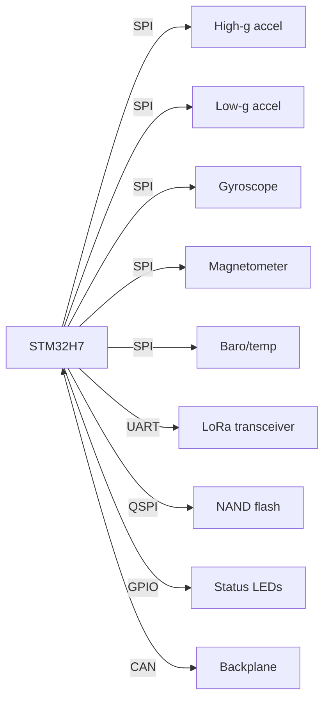

# Secondary Card
{: .no_toc }

The backup to the Primary Card. It measures the same kinds of things with mostly different parts (plus a
high-g accelerometer), has a LoRa backup radio, and has no GPS.
{: .fs-5 .fw-300 }

CARD_TYPE
: 8 (also the default CARD_ID)

MCU
: STM32H730VBT6, talking to its parts over SPI6 and UART, and to the backplane over CAN

Flash
: W25N512GV, 64 MB NAND over QUADSPI

Radio
: RN2483A LoRa, 433 MHz

Firmware
: [`Firmware/Secondary_Card`](https://github.umn.edu/Rocket-Team/UFC-2024/tree/main/Firmware/Secondary_Card)
{: .facts }

  
Contents

  {: .text-delta }
- TOC
{:toc}

## Purpose

The Secondary Card collects and stores sensor data, runs the long-range LoRa link, and does light processing
like converting raw readings into real units. Like the Primary Card, it writes to its own flash once its
state detection sees a launch.

Because it duplicates the Primary Card's measurements, we can test and fly one data card before the other is
done. [Design History]({{ '/docs/projects/ufc/design-history/' | relative_url }}#ufc3-202425) explains why the
cards are split this way.

Redrawn from `Data Card 2 Block Diagram` in the team Drive (`03-Avionics IREC/Diagrams`). The old wiki's version is
below. Note the barometer on SPI; see the box under [Sensors](#sensors).



## Components

| Part | Part no. | Bus | Notes |
|:--|:--|:--|:--|
| Microcontroller | [STM32H730VBT6](https://www.digikey.com/en/products/detail/stmicroelectronics/STM32H730VBT6/13171210) | SPI, UART, CAN | 100 pin, 550 MHz, 128 KB flash |
| Flash | [W25N512GV](https://www.winbond.com/resource-files/w25n512gv%20rev%20c%20112118.pdf) | QUADSPI | 64 MB NAND, same circuit as the Primary Card |
| Radio | [RN2483A](https://www.arrow.com/en/products/rn2483a-irm104/microchip-technology) | UART, RTS/CTS | 433 MHz LoRa, 13.6 dBm (23 mW) max, 250 kbps air data rate |
| LEDs | Red, green, blue, yellow (Würth 150060 series) | GPIO | Same as the Primary Card |

### Sensors

| Sensor | Part no. | Bus | Range | Accuracy | Interrupts |
|:--|:--|:--|:--|:--|:--|
| 3-axis gyroscope | [I3G4250D](https://www.st.com/resource/en/datasheet/i3g4250d.pdf) | SPI (≤10 MHz) | ±245 / ±500 / ±2000 dps | | INT1, DRDY/INT2 |
| 3-axis high-g accelerometer | [H3LIS200DLTR](https://www.st.com/resource/en/datasheet/h3lis200dl.pdf) | SPI (≤10 MHz) | ±100 / ±200 g | ±1.5 g | INT1, INT2 |
| 3-axis low-g accelerometer | [LIS2DW12TR](https://www.st.com/resource/en/datasheet/lis2dw12.pdf) | SPI (≤10 MHz) | ±2 / ±4 / ±8 / ±16 g | ±0.02 g | INT1, INT2 |
| 3-axis magnetometer | [LIS3MDL](https://www.st.com/resource/en/datasheet/lis3mdl.pdf) | SPI (≤10 MHz) | ±4 / ±8 / ±12 / ±16 gauss | | MAG_DRDY, INT1 |
| Barometer/thermometer | [BMP390](https://www.bosch-sensortec.com/media/boschsensortec/downloads/datasheets/bst-bmp390-ds002.pdf) | Probably SPI (old wiki: I2C, 0x76) | 30–125 kPa, −40–85 °C | | INT |

**Why two accelerometers.** The high-g part (H3LIS200DL) covers the big accelerations of boost but is less
precise. The low-g part (LIS2DW12) is much more precise but saturates sooner. Between them you get both.

More on the shared parts in the [Parts Reference]({{ '/docs/projects/parts-reference/' | relative_url }}).

{: .check }
> **Which bus is the barometer on?** The old wiki says the BMP390 is wired like the Primary Card's (I2C, address
> 0x76), and that the sensors are on SPI6. Two other sources disagree:
>
> - The `UFC-2024 Pin Allocations` sheet puts all of this card's sensors on **SPI2** (PB13 SCK, PB14 CIPO, PB15 COPI),
>   with chip selects for the magnetometer (PC0), gyro (PC1), low-g (PC2), high-g (PC3), and a "temp" sensor (PC4),
>   and the LoRa on UART7.
> - The Data Card 2 block diagram (above) draws the baro/temp sensor on the same SPI bus as the other four.
>
> So the barometer is probably on SPI on this card, and the I2C details were copied from the Primary Card. Check the
> schematic to be sure.

### Sensor settings

How the firmware configures each sensor, from the firmware subteam's `UFC Sensor Range, ODR, Modes` notes (around
the end of 2024). "Measured" is the rate they actually saw.

| Sensor | Range | Output rate | Mode / notes |
|:--|:--|:--|:--|
| I3G4250D gyro | ±245 dps | 400 Hz (428 Hz measured) | Options: 100–800 Hz |
| LIS2DW12 low-g | ±16 g | 400 Hz (406 Hz measured) | High-performance mode only |
| H3LIS200DL high-g | ±200 g | 400 Hz (404 Hz measured) | High-performance mode only. The notes say it doesn't show the 1 g of gravity at rest. |
| LIS3MDL magnetometer | ±4 gauss (about ±3 usable after zeroing) | 300 Hz (305 Hz measured) | Uses FAST_ODR. The notes list the FAST_ODR rates as 155 Hz (low power), 300 Hz (medium), 560 Hz (high), and 1000 Hz (ultra-high performance); without FAST_ODR you can pick 0.625–80 Hz. |
| BMP390 | 300–1100 hPa | Not finalised | Same settings as the [Primary Card]({{ '/docs/projects/ufc/cards/primary-card/' | relative_url }}#sensor-settings) |

The same notes record a known issue from that time: with single-SPI flash writes and about 10 s of pad data, this
card missed **1.3 s of flight at the start of ascent** while it wrote its circular buffer (296,000 bytes then) to flash.
The [Flash Driver]({{ '/docs/projects/ufc/firmware/flash-driver/' | relative_url }}#why-the-buffer-is-written-last)
page describes how the driver handles this now.

### Radio

The RN2483A is the secondary (backup) telemetry link and talks over UART. The module supports the 433 MHz and
868 MHz bands; we use 433 MHz. Command reference:
[RN2483 LoRa UART reference](https://ww1.microchip.com/downloads/en/DeviceDoc/40001784B.pdf).

In practice it's the **command link**. At IREC 2025 the team sent pad commands through it with `lora.py`, and
used the RFD only when the LoRa didn't answer
([Flight Operations]({{ '/docs/projects/ufc/operations/' | relative_url }}#check-the-lora-link)). Commands that come
in over the LoRa run on this card, so you start on card 8. If the link drops, restarting this card over the RFD
(`cd 8`, `restart`, about 10 seconds) sometimes brings it back; so does `lora sys get ver`.

The LoRa already met the 2026 IREC radio rules, so it stays. The plan at the December 2025 PDR was two 433 MHz
LoRa links: this one for commands, and the Primary Card's new E22 for data
([Primary Card]({{ '/docs/projects/ufc/cards/primary-card/' | relative_url }}#radio)). The PDR's link budget gave
the RN2483 a 13.2 dB margin at 10 km.

## Schematic

The old wiki didn't include a schematic image for this card. Check Altium 365.

## PCB

| Layer | Pour | Routing | Image |
|:--|:--|:--|:--|
| Top | GND | Signals | [view ↗](https://github.umn.edu/Rocket-Team/UFC-2024/assets/25645/c198556a-d312-4113-a993-7fc606cbee96) |
| Mid 1 | GND | None | [view ↗](https://github.umn.edu/Rocket-Team/UFC-2024/assets/25645/6a9b20d2-9012-49c7-a4ea-667ae284899e) |
| Mid 2 | 3.3 V | None | [view ↗](https://github.umn.edu/Rocket-Team/UFC-2024/assets/25645/28cad37d-e2fd-4120-a9e4-69a1a0dc6fbe) |
| Bottom | GND | Signals | [view ↗](https://github.umn.edu/Rocket-Team/UFC-2024/assets/25645/c203e282-147e-41f1-a93b-d102bb58d1f7) |

Renders: [3D view ↗](https://github.umn.edu/Rocket-Team/UFC-2024/assets/25645/177a1e70-8f49-4b0d-bb2c-c748a25a9c35) ·
[2D view ↗](https://github.umn.edu/Rocket-Team/UFC-2024/assets/25645/02502518-16cb-499b-a664-a769f3b77201)
(image links need a UMN login)

## Firmware

Card-specific drivers, on top of the shared [UFC_Core]({{ '/docs/projects/ufc/firmware/' | relative_url }}) library:

- [`BMP390_Driver.h`](https://github.umn.edu/Rocket-Team/UFC-2024/blob/main/Firmware/Secondary_Card/Secondary_Card/BMP390_Driver.h): barometer/thermometer
- [`H3LIS200DL_Driver.h`](https://github.umn.edu/Rocket-Team/UFC-2024/blob/main/Firmware/Secondary_Card/Secondary_Card/H3LIS200DL_Driver.h): high-g accelerometer
- [`LIS2DW12_Driver.h`](https://github.umn.edu/Rocket-Team/UFC-2024/blob/main/Firmware/Secondary_Card/Secondary_Card/LIS2DW12_Driver.h): low-g accelerometer
- [`I3G4250D_Driver.h`](https://github.umn.edu/Rocket-Team/UFC-2024/blob/main/Firmware/Secondary_Card/Secondary_Card/I3G4250D_Driver.h): gyroscope
- [`LIS3MDL_Driver.h`](https://github.umn.edu/Rocket-Team/UFC-2024/blob/main/Firmware/Secondary_Card/Secondary_Card/LIS3MDL_Driver.h): magnetometer
- [`RN2483A_Driver.h`](https://github.umn.edu/Rocket-Team/UFC-2024/blob/main/Firmware/Secondary_Card/Secondary_Card/RN2483A_Driver.h): LoRa radio

The timestamp and timer plan that used to live on this page applies to every card, so it's now on the
[Firmware]({{ '/docs/projects/ufc/firmware/' | relative_url }}#timestamps) page.
