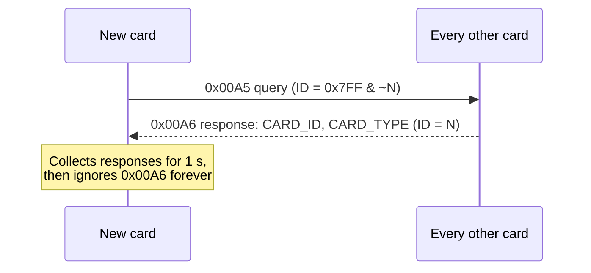
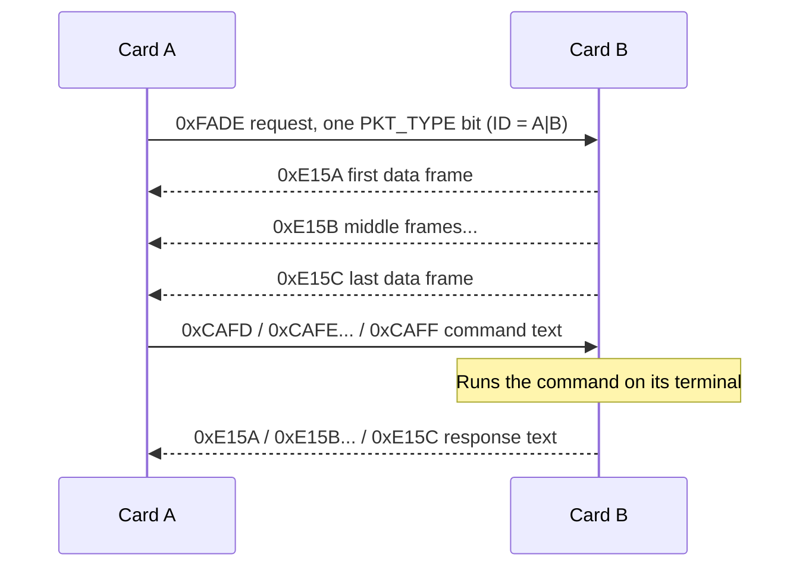

# CAN Protocol (UFCAN 1.0)
{: .no_toc }

How UFC cards talk to each other over the backplane. Implemented by the `phone` class in UFC_Core.
{: .fs-5 .fw-300 }

Spec
: UFC Backplane CAN Spec 1.0 ("UFCAN 1.0"), by Ryan Srichai, 8 July 2024

Code
: [`UFC_Core/phone.h`](https://github.umn.edu/Rocket-Team/UFC-2024/blob/main/Firmware/UFC_Core/phone.h)

Bus
: Classic (standard) CAN, 11-bit identifiers, 1 Mbit/s. Not CAN FD, not extended CAN.

Payload
: Always 8 data bytes per frame

Max cards
: 11
{: .facts }

  
Contents

  {: .text-delta }
- TOC
{:toc}

---

## The idea

It works like a phone call. One card calls one other card with a request or a command, and that card answers
with data. While the call is going, any other card trying to reach either of them has to wait. There's no
broadcast data, and no way to tell that a card has left the network.

Because a response is usually longer than one 8-byte CAN frame, bigger messages are split into a series of
frames: a first frame, any number of middle frames, and a last frame.

## Addressing

**CARD_ID.** Every card on the bus has a CARD_ID that is a power of two and fits in 11 bits, so each card
owns one bit of the CAN identifier. That's where the 11-card limit comes from. Two cards with the same CARD_ID
is undefined behaviour and will cause bus errors.

**CARD_TYPE.** Says what kind of card it is. Also a power of two, up to 16 bits. See the
[table below](#card_type-values).

**The identifier is sender OR receiver.** A normal message uses `Sender | Receiver` as its 11-bit identifier.
Each card's CAN filter only accepts frames with its own bit set, so only the two cards in the conversation pick
it up. Replies use the same identifier. In CAN normal mode a card never receives its own frames, so it won't
hear itself.

For example, the Primary Card (CARD_ID 4) talking to the Interface Card (CARD_ID 2) uses identifier `0x006` in
both directions.

**Talking to everyone.** `0x7FF` would reach every card, but a card can't send with the same identifier as
another card. So the one broadcast message, the query a card sends when it joins, uses `0x7FF & ~Sender`
(everyone except me). The responses use the bitwise NOT of that, which works out to just the new card's bit.

## Message types

The first two data bytes say what kind of UFCAN message a frame is. The spec calls these "UFCAN packets",
which are not the same thing as [UFC packets]({{ '/docs/projects/ufc/firmware/packets/' | relative_url }}).

| Identifier | Bytes 0–1 | Bytes 2–3 | Bytes 4–5 | Bytes 6–7 | Meaning |
|:--|:--|:--|:--|:--|:--|
| `0x7FF & ~Sender` | `0x00A5` | `0x00F1` | CARD_ID | CARD_TYPE | Query: "I just joined" |
| `~(query identifier)` | `0x00A6` | `0x00F1` | CARD_ID | CARD_TYPE | Query response: "I'm here too" |
| `Sender \| Receiver` | `0xFADE` | `0x0000` | PKT_TYPE | PKT_TYPE | Request a packet |
| `Sender \| Receiver` | `0xCAFD` | CMD | CMD | CMD | Command, first frame |
| `Sender \| Receiver` | `0xCAFE` | CMD | CMD | CMD | Command, middle frame |
| `Sender \| Receiver` | `0xCAFF` | CMD | CMD | CMD | Command, last frame |
| `Sender \| Receiver` | `0xE15A` | DATA | DATA | DATA | Data, first frame |
| `Sender \| Receiver` | `0xE15B` | DATA | DATA | DATA | Data, middle frame |
| `Sender \| Receiver` | `0xE15C` | DATA | DATA | DATA | Data, last frame |

**Query (`0x00A5`)** is sent once, shortly after a card powers on, and never again. It tells every other card
this card's CARD_ID and CARD_TYPE.

**Query response (`0x00A6`)** is what every other card sends back when it hears a query, with its own CARD_ID and
CARD_TYPE. The new card spends **1 second** collecting responses, then ignores `0x00A6` frames forever.

**Request (`0xFADE`)** asks one specific card for one type of UFC packet. Bytes 4–7 form a 32-bit PKT_TYPE field
with **exactly one bit set** ([PKT_TYPE table](#pkt_type-values)). Setting more than one bit is undefined
behaviour.

**Command (`0xCAFD` / `0xCAFE` / `0xCAFF`)** carries a plain-text [terminal]({{ '/docs/projects/ufc/firmware/terminal/' | relative_url }})
command, which the receiving card runs as if it had been typed into its own terminal. Each frame holds 6 bytes
of text. Send a first frame, as many middle frames as needed, then a last frame with whatever's left, padded
with `0x00`. **Always send both a first and a last frame**, even if the command fits in 6 bytes. In that case,
skip the middle frames and send a last frame that's all padding.

**Data (`0xE15A` / `0xE15B` / `0xE15C`)** is split up the same way. It carries either a command's response (plain
text) or a requested packet (binary). As long as a first and a last frame both arrive, it works.

### What a conversation looks like

A card joining the network:

Requesting a packet, and sending a command:

## Rules that keep the bus working

**Never let two frames with the same identifier go out at the same time.** In CAN that causes a
[bit error](https://electronics.stackexchange.com/questions/43139/transmission-of-different-messages-with-the-same-id-on-a-can-bus/43150#43150),
which can knock a card off the bus or fill the bus with error frames indefinitely. That's why CARD_IDs must be
unique. But unique IDs aren't enough by themselves:

> Card A sends a command to Card B. B waits for the whole command, gets the `0xCAFF`, runs it, and starts
> sending the response. Meanwhile A starts sending B *another* command. Both are now transmitting with
> identifier `A|B`, and you get a bit error.

So: **a card must not send anything (request, command, or data) to a card it's waiting on**, until the response
arrives or a timeout expires.

**Cards can't request from several cards at once**, and a card can't detect when another card leaves the network.

{: .check }
> Two things in the original spec look off, and are worth checking against the `phone` code:
>
> - **RTR bit.** The spec says the RTR bit is always 1. In standard CAN a *data* frame has RTR = 0 (dominant);
>   RTR = 1 marks a *remote* frame, which the spec also says UFCAN doesn't use. It's probably a typo. The
>   STM32's FDCAN peripheral sets this bit from the frame type the code asks for, so check that `phone` sends
>   data frames.
> - **Query responses share an identifier.** Every card answers a query with the same identifier (the new
>   card's bit) but different data, which is exactly the same-identifier collision described above. CAN will
>   retry after the error, so it may sort itself out, but if cards ever fail to see each other at power-up,
>   look here first.

## Edge cases

The spec walks through three awkward situations:

1. **Several cards power on at once.** They all try to send `0x00A5` at about the same time. As long as their
   CARD_IDs are unique, CAN arbitration lets one through first. That triggers every other card to respond, and
   arbitration picks the order of the responses too. Only the card that sent the query receives them. From
   there it untangles: one card is back in its main loop trying to send its own query, one is collecting
   responses, and the rest are trying to send responses.
2. **Two cards request from the same card at once.** Arbitration picks one (the one with the lower CARD_ID
   wins, since lower identifiers win in CAN). The response may block the other request until it finishes, and
   then the card can answer it. If the other request slips in partway through the response, it's ignored,
   because a lower-priority message won't trigger the interrupt. That request times out.
3. **A higher-priority request arrives while a card is busy responding.** The higher-priority request wins
   arbitration over the outgoing data and interrupts the card.

## Frame format

For reading traffic on a logic analyzer. A UFCAN frame is always a standard CAN data frame with 8 data bytes.
In CAN, a 0 bit is **dominant** and a 1 bit is **recessive**.

| Field | Bits | Value in UFCAN |
|:--|--:|:--|
| Start of frame | 1 | 0 |
| Identifier | 11 | See [Addressing](#addressing) |
| RTR | 1 | Spec says 1 (see the box above) |
| IDE | 1 | 0 (standard 11-bit ID) |
| Reserved | 1 | 0 |
| Data length (DLC) | 4 | `1000` (8 bytes) |
| Data | 64 | See [Message types](#message-types) |
| CRC | 16 | Depends on the data |
| ACK | 2 | `01` if a receiver acknowledged, `11` if not |
| End of frame | 7 | All 1s |

CAN uses a differential pair (CAN_P and CAN_N on the backplane): each bit shows up on both lines as mirror
images of each other. UFCAN doesn't use remote frames or overload frames.



A good general intro to CAN is CSS Electronics' [CAN bus explained](https://www.csselectronics.com/pages/can-bus-simple-intro-tutorial).

## CARD_TYPE values

| CARD_TYPE | Card |
|--:|:--|
| 1 | Power Card (reserved; it has no MCU) |
| 2 | Interface Card |
| 4 | Primary Card |
| 8 | Secondary Card |
| 16 | Pitot Sensor Card |
| 32 | Primary Card used as a ground station |

Open to extension: new card types get the next power of two, up to 16 bits.

## PKT_TYPE values

Used in the request frame (`0xFADE`) to say which packet you want. One bit per packet type.

| PKT_TYPE | Packet |
|--:|:--|
| 1 | `rawPkt_t` |
| 2 | `realPkt_t` |
| 4 | `bnoPkt_t` |
| 8 | `tempBaroPkt_t` |
| 16 | `gpsPkt_t` |
| 32 | `pitotPkt_t` |
| 64 | `airbrakePkt_t` |

{: .check }
These names don't match the packet list on the [Packets]({{ '/docs/projects/ufc/firmware/packets/' | relative_url }})
page (`STATUS_PKT`, `SENSOR_PKT`, ...), so one of them is from an older version of the code.
[`packets.h`](https://github.umn.edu/Rocket-Team/UFC-2024/blob/main/Firmware/UFC_Core/packets.h) is the source of truth.
