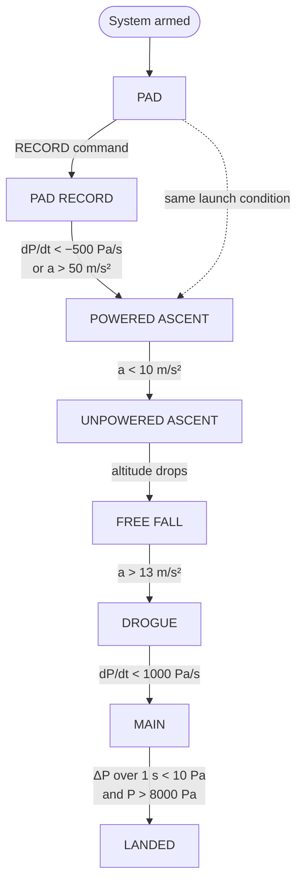

# Firmware
{: .no_toc }

Each card runs its own binary, and they're all built on a shared library called **UFC_Core**. This page is
the map; the pages under it have the specs and the details.
{: .fs-5 .fw-300 }

Language
: C++, using STM32CubeIDE and the ST HAL

Repo
: [UFC-2024 → `Firmware/`](https://github.umn.edu/Rocket-Team/UFC-2024/tree/main/Firmware)

Shared library
: [`Firmware/UFC_Core`](https://github.umn.edu/Rocket-Team/UFC-2024/tree/main/Firmware/UFC_Core)

Scheduling
: No RTOS. One main loop per card, statically scheduled.
{: .facts }

{: .check }
Every firmware link in the old wiki points at the **UFC-2024** repository, even though the wiki itself
belonged to UFC-2026. If the UFC 3.5 firmware lives somewhere newer, these links need updating.

**New to the codebase?** Do the [firmware tutorial]({{ '/docs/tutorials/firmware/' | relative_url }}) first,
then [set up STM32CubeIDE]({{ '/docs/projects/ufc/firmware/ide-setup/' | relative_url }}) and come back here.

  
Contents

  {: .text-delta }
- TOC
{:toc}

## How it runs

Most of this section comes from a firmware write-up drafted for the 2025 technical report.

- **One binary per card.** Every peripheral has its own custom driver, and what each card is responsible for
  was planned out card by card.
- **No RTOS.** Each card's main loop does everything that card does. Sensors don't all poll at the same rate,
  so work is arranged with a **static cooperative schedule**: you figure out how long each operation takes and
  slot it into the loop. That covers synchronous work like polling sensors and sending live telemetry.
- **Mostly not interrupt-driven.** Interrupts are used for specific things: the radios, card-to-card CAN
  messages, and the terminal's UART.
- **Nothing is allowed to hang.** An endless loop would stall everything else on the card, so every loop has a
  way out: a maximum number of tries when reading a peripheral's status register, a timeout on every blocking
  I/O call, and no loop that could in principle run forever.

## UFC_Core

Every card with a microcontroller (Primary, Secondary, Interface, and Pitot) includes UFC_Core.

| Feature | What it is | Docs |
|:--|:--|:--|
| Clock config and boot | Common startup code | [`common_init.cpp`](https://github.umn.edu/Rocket-Team/UFC-2024/blob/main/Firmware/UFC_Core/common_init.cpp) |
| Packets | The data format for everything the UFC stores and sends | [Packets]({{ '/docs/projects/ufc/firmware/packets/' | relative_url }}) |
| State detection | Works out the rocket's flight state from acceleration and pressure. Starts and stops recording. | [State detection](#state-detection) below |
| Error codes (ECODEs) | Bitfield return codes used by most functions | [Error Codes]({{ '/docs/projects/ufc/firmware/error-codes/' | relative_url }}) |
| LED driver | The four status LEDs | — |
| Flash driver | Driver for the W25N512GV NAND flash | [Flash Driver]({{ '/docs/projects/ufc/firmware/flash-driver/' | relative_url }}) |
| Circular buffer | Holds the last ~10 s of data before launch | [Flash Driver]({{ '/docs/projects/ufc/firmware/flash-driver/' | relative_url }}#the-circular-buffer) |
| Terminal | The UART command line | [Terminal]({{ '/docs/projects/ufc/firmware/terminal/' | relative_url }}) |
| Phone | Card-to-card messaging over CAN | [CAN Protocol]({{ '/docs/projects/ufc/firmware/can-protocol/' | relative_url }}) |

The terminal, the phone, and state detection are the three most complicated pieces.

## State detection

State detection decides what the rocket is doing from pressure and acceleration, and the card acts on it: recording
starts at launch, and after landing the pre-launch data is moved into place. This is the UFC3 (2024–25) state machine,
from the `UFC3 State Diagram` drawio in the team Drive's `03-Avionics IREC/Diagrams` folder:

P is barometric pressure and a is acceleration. The terminal commands `RECORD` and `LAND` force the
`UFC_STATE_PAD_RECORD` and `UFC_STATE_LANDED` states by hand
([Flight Operations]({{ '/docs/projects/ufc/operations/' | relative_url }}#recording)). The old wiki calls this a
seven-stage module; the diagram has eight states, or seven if you don't count PAD RECORD.

What we know about how it works, mostly from the Q&A at the December 2025 PDR:

- **Filtering.** Pressure and acceleration go through a 1-second rolling median before they're compared to a
  threshold, so a bump on the pad shouldn't trigger launch. The landing check might use raw pressure instead; the
  answer at the PDR wasn't sure.
- **Launch is an OR.** Either the pressure rate or the acceleration is enough.
- **Where the thresholds came from.** Simulations. They haven't been checked against flight data.
- **The failsafe.** A time-after-liftoff timer triggers the data transfer if landing isn't detected. There's no
  other way to reach LANDED: if the card misses DROGUE or MAIN, it never gets there.

{: .warning }
> **At IREC 2025 the UFC didn't detect the launch.** Recording only happened because someone sent `RECORD` by hand.
> The Pitot card, which also runs state detection from its own pressure data, did detect it. The team looked at the
> data afterwards and found the spot where the UFC should have triggered, but never worked out why it didn't. Until
> someone does, [start recording by hand]({{ '/docs/projects/ufc/operations/' | relative_url }}#recording).

Action items from the 2025–26 PDR:
- Compare the UFC's state detection, post-processed on the IREC 2025 data, against the Blue Ravens (the COTS
  altimeters) and against the Pitot card's algorithm.
- Add redundant paths to LANDED, such as time since liftoff. Size the timeout for off-nominal flights too, like the
  main opening at apogee.
- Filter out pressure spikes from the ejection charges. This matters more for the payload board, which sits right
  next to them.
- Consider converting pressure to altitude above ground level (and differentiating it to get velocity) so thresholds
  work at different launch sites. Marked optional.

## Card firmware

| Card | CARD_TYPE | Card-specific drivers |
|:--|:--|:--|
| [Primary]({{ '/docs/projects/ufc/cards/primary-card/' | relative_url }}#firmware) | 4 | BNO055 IMU, BMP390 barometer, MAX-M10S GPS, RFD900UX2 radio (an E22 LoRa from 2025–26) |
| [Secondary]({{ '/docs/projects/ufc/cards/secondary-card/' | relative_url }}#firmware) | 8 | BMP390, H3LIS200DL, LIS2DW12, I3G4250D, LIS3MDL, RN2483A LoRa |
| [Interface]({{ '/docs/projects/ufc/cards/interface-card/' | relative_url }}#firmware) | 2 | Not documented. The block diagram has an SD card, the buzzer, and four mode switches. |
| [Pitot]({{ '/docs/projects/pitot/sensor-card/' | relative_url }}#firmware) | 16 | [`Firmware/Pitot_Card`](https://github.umn.edu/Rocket-Team/UFC-2024/tree/main/Firmware/Pitot_Card) |

CARD_TYPE is defined in [`packets.h`](https://github.umn.edu/Rocket-Team/UFC-2024/blob/main/Firmware/UFC_Core/packets.h).
The Primary and Secondary cards also use their CARD_TYPE as their default CARD_ID.

## Timestamps

The timestamp in every packet header is an unsigned 64-bit number, but the STM32s on the cards don't have a
64-bit timer. So the timestamp is split in two:

| Bits | Holds |
|:--|:--|
| Upper 32 | Seconds since start |
| Lower 32 | Microseconds within the current second |

That makes time differences between packets slightly more annoying to compute, but it's simple to implement and
won't roll over for a very long time.

- **TIM2** is the timestamp timer on every card.
- **TIM3** is left free for syncing to the GPS's PPS (pulse-per-second) output later.

The PPS plan, which wasn't implemented as of the old wiki, follows
[this Stack Exchange answer](https://electronics.stackexchange.com/questions/418594/how-to-use-1pps-to-synchronize-esp32-clocks-and-peripherals):
connect TIM3_CH1 to the PPS line, then set TI1S in TIM3_CR2 so that pin feeds TIM3's TI1 input, which can reset
or start the timer. The details are in the timer section of the reference manual, and section 5 of the MCU
datasheet lists which pins have TIM3_CH1 as an alternate function.

{: .check }
The overnight test results quote timestamps in milliseconds, which doesn't match the seconds + microseconds
format above. Either WINGS converts them or the format changed. Check `packets.h`.

## Design philosophy

- **Everything is available to everyone.** All driver classes are public and there's a global instance of each
  driver that any part of the code can use. Terminal commands have no restrictions, and they can come from
  anywhere: the programmer UART, either radio, or another card. That gives full remote control of the UFC.
- **No security, on purpose.** There's no notion of security anywhere on the UFC, and both the hardware and
  firmware are open source.
- **Every loop has a timeout** (see [How it runs](#how-it-runs)).

## Pages in this section

| Page | What's on it |
|:--|:--|
| [CAN Protocol]({{ '/docs/projects/ufc/firmware/can-protocol/' | relative_url }}) | UFCAN 1.0: how cards address each other, message types, CARD_TYPE and PKT_TYPE tables |
| [Terminal]({{ '/docs/projects/ufc/firmware/terminal/' | relative_url }}) | UFCTI 1.0: command format and the commands we know about |
| [Packets]({{ '/docs/projects/ufc/firmware/packets/' | relative_url }}) | Packet types, who produces them, and their sizes |
| [Flash Driver]({{ '/docs/projects/ufc/firmware/flash-driver/' | relative_url }}) | How NAND flash behaves, the driver's rules, and the pre-launch circular buffer |
| [Timings & Budgets]({{ '/docs/projects/ufc/firmware/timings/' | relative_url }}) | Bus speeds, loop rates, flash fill times, transfer times, telemetry bandwidth |
| [Error Codes]({{ '/docs/projects/ufc/firmware/error-codes/' | relative_url }}) | ECODE values and how to test for them |
| [STM32CubeIDE Setup]({{ '/docs/projects/ufc/firmware/ide-setup/' | relative_url }}) | Importing the projects, fixing source paths, run configurations |
