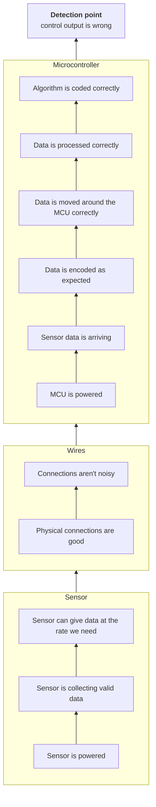

# Debugging
{: .no_toc }

How to find a bug on purpose instead of changing random things until it goes away. Applies to every subteam, but
most of the examples are firmware and hardware.
{: .fs-5 .fw-300 }

  
Contents

  {: .text-delta }
- TOC
{:toc}

Based on the "Bugs & Debugging" talk from an avionics meeting in October 2024.

## The lifecycle of a bug

1. We think there are no problems.
2. The bug shows up somewhere. That's the **detection point**.
3. Find where the bug actually comes from.
4. Fix it.

Step 3 is almost always the slow one. The rest of this page is about making it faster.

## The bug triangle

The place a bug shows up is rarely where it starts. Between the detection point and the real cause there's a
stack of things you're assuming work. The **bug triangle** lays those out, from the detection point at the top down
to the most basic assumptions at the bottom.

**Start at the bottom and check each assumption on the way up**, until you reach the first thing that doesn't
behave the way you expect. That's where the bug is.

Here's the example from the talk: a control algorithm is giving the wrong output, and the chain behind it runs from
a sensor, over some wires, into a microcontroller.

It's tempting to start at the top, since that's where you noticed the problem and it's usually the code you just
wrote. Checking from the bottom means you never spend an hour on the algorithm when the sensor was unplugged.

## Q/A format

A way to keep track of where you are, so you're debugging with a purpose instead of guessing.

1. **State the problem formally.** "The control algorithm is outputting the wrong values."
2. **Ask the first question.** Usually it's the first thing in the bug triangle you're going to check. "Is the sensor
   powered correctly?"
3. **Answer it, then ask the next question.** "The sensor is powered correctly. Is it calibrated? Does it give the
   expected values at rest?"

Write it down as you go. When you ask for help, it's also a record of everything you've already checked.

## Rubber ducking

Explain the problem out loud to someone, step by step. It doesn't matter whether they understand it, and the someone
can be an inanimate object (traditionally a rubber duck). Having to say each step often shows you the one you skipped.
Yes, it really works, and it has its own [Wikipedia page](https://en.wikipedia.org/wiki/Rubber_duck_debugging).

## Breakpoints and the memory viewer

For firmware, these are much better than adding `printf`s.

- **Breakpoints** show you whether a function actually gets called, and let you pause the code at a specific line.
- The **memory viewer** lets you look at variables and registers while it's paused.

We can't overstate how useful these are. Please use them. In STM32CubeIDE you need a Debug build configuration to use
them ([STM32CubeIDE Setup]({{ '/docs/projects/ufc/firmware/ide-setup/' | relative_url }}#4-set-up-run-configurations)).
For hardware and bus problems, a logic analyzer (we have Saleaes) does the same job for the wires.

## Asking for help

Don't sit on a bug for days. The GNC subteam's [two-hour rule]({{ '/docs/tutorials/gnc/' | relative_url }}#some-gnc-best-practices-not-just-for-crash-course)
is a good default for everyone: if you're stuck for an hour or two, ask.

How you ask makes a big difference:

- **Hard to help with:** "It isn't working." What is "it"? How do you know it's broken? What's it supposed to do?
  What have you already tried? Answering all that takes forever.
- **Easy to help with:** "X isn't doing *\<specific behaviour\>*. I've checked that A, B, and C are working, and I can't
  think of anything else it could be."

Bring the command or code you're running, the **full** error message, and your Q/A notes. People will love you for it.

## Testing

The voice telling you your code will work perfectly the first time is lying. Things interact and break in weird ways,
and people in the future will rely on what you wrote. If their stuff breaks because you didn't take the time to test,
they have every right to curse your name.

| Kind | What it covers |
|:--|:--|
| **Unit** | Small, separate pieces of code, like single functions |
| **Integration** | Two or three units working together |
| **System** | The whole system (or big parts of it) running flight code |

The UFC's test procedures are on [Testing & Validation]({{ '/docs/projects/ufc/testing/' | relative_url }}).

## Reliable isn't the same as safe

Two assumptions that sound reasonable and aren't:

1. *If every component is reliable, the system is reliable.* Components can work perfectly and the system can still
   fail, and a system can keep working with a failed component.
2. *A reliable system is a safe system.*

Two famous examples:

- **Mars Polar Lander (1999).** Every component did exactly what it was designed to do, and the lander still hit Mars
  from about 40 m up. The most likely cause in NASA's
  [failure report](https://web.archive.org/web/20151213144413/ftp://ftp.hq.nasa.gov/pub/pao/reports/2000/2000_mpl_report_1.pdf):
  the touchdown sensors picked up the jolt of the landing legs deploying, and the software took that as touchdown and
  shut the engine off early.
- **Ariane 5 flight V88 (1996).** Code reused from an older mission had no protection against an integer overflow. The
  resulting exception was handled badly and took down the inertial navigation system.

## Bugs we've had

A few from the UFC over the years. Most of them are funny now.

| Bug | What happened |
|:--|:--|
| **Single-program cards** | Cards died after being programmed once. The firmware was set up for a power supply configuration that didn't match the hardware. |
| **Curse of the random function call** | A bad array access through a pointer smashed the stack, so the code jumped into functions nobody called. |
| **Junk flash data** | There was no protection against overwriting flash. |
| **Spontaneous combustion** | A radio card set itself on fire two weeks before launch. |
| **Card vs. card violence** | A fast card sent data to a slower card until the slow one crashed. |
| **GPS is mad** | If the GPS didn't get a lock, the code went into an infinite loop. The UFC firmware's rule now is that [every loop needs a timeout]({{ '/docs/projects/ufc/firmware/' | relative_url }}#how-it-runs). |
| **Forgot to set the alarm** | Timers "weren't working". They had never been enabled or started. |
| **Oops, I forgot to turn it on** | Everyone has tried to talk to a card that wasn't powered. Check this first. |
| **The probe that needed an audience** | The old Teensy-based pitot firmware only worked while the logic analyzer was clipped on, even with the analyzer unpowered. The theory at the time: the extra ~10 pF per line from the analyzer was damping voltage transients that were clocking the ADC out of sync. |

And one from outside avionics: a test stand whose heater kept going if its thermocouples died, until it melted down
at 1600 °C.
