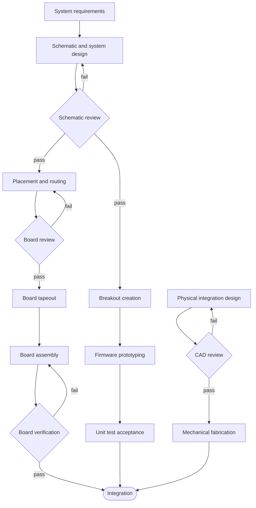

# Hardware Design Practices
{: .no_toc }

How the hardware subteam takes a board from an idea to something firmware can program, and the conventions we
follow in Altium along the way. Read this after the [Altium basics]({{ '/docs/tutorials/hardware/' | relative_url }}#altium-basics-tutorial),
and before your first schematic review.
{: .fs-5 .fw-300 }

<details markdown="block">
  <summary>Contents</summary>
  {: .text-delta }
- TOC
{:toc}
</details>

From the old wiki's hardware design practices page, the firmware subteam's 2023 card design preferences, and the
2025–26 PDR action items. Where they disagree with what we do now, there's a note.

## Design process

Every mistake that makes it onto a manufactured board costs money, and worse, time: finding the error, reordering,
reassembling, and retesting. Hardware delays eat into the time firmware has to program the board. So a new board (or
a big revision) goes through review gates before anything gets ordered.

The current version of the process, from the `Avionics Board Design Cycle` diagram in the team Drive:



Three tracks run in parallel. The hardware track (schematic, layout, assembly) is the critical path. Once the schematic passes review, the
firmware subteam can build **breakouts** of the new parts and start writing drivers before the real board exists,
and the structures side designs how the board mounts. Everything meets at integration.

The older version in the old wiki had four stages, which still describe what each step should produce:

1. **Specifications.** The avionics lead and the subteam leads agree on what the board needs to do, and write it down.
   These days that's the [requirements]({{ '/docs/tutorials/systems-engineering/' | relative_url }}#requirements).
2. **Schematic design.** Whoever owns the board picks the parts (checking with the rest of hardware, and with firmware
   so the parts work with the flight computer architecture) and draws the schematic. Ends with a **schematic review**
   with the rest of avionics. Fix everything it finds before moving on.
3. **Test plan.** Hardware and firmware agree on how the board will be tested and what to add to make that easier.
   For example: after assembly, check every adjacent pair of pins with a multimeter for solder bridges; add a test pin
   on the SPI MOSI line so a Saleae can clip on. This can happen in the same meeting as the schematic review.
4. **PCB design.** Lay out the board from the spec, schematic, and test plan. Ends with a **PCB design review** that
   checks it against all three, and against the [layout checklist](#final-layout-checklist) below.

## Project setup

Create new projects in the team's [Altium 365 workspace](https://rocket-team.365.altium.com/designs), in the right
folder, then open them in Altium Designer. That keeps them in Altium's version control, and anyone can view them in
the browser without opening Altium. Some older projects are on GitHub instead.

For a major revision, make a new file: duplicate the old one, rename it with the new revision number, and change that.

## Schematic

**Layout.** Split the schematic into sections and connect them with named nets instead of long wires. Box each
section and title it in plain English ("GPS", not "MAX-M10S-00B") so someone can tell what it does at a glance. We use
a single sheet per board and make it bigger as needed.

**Notes.** Write notes on the schematic for anything unusual: a design decision that isn't obvious, or an instruction
for whoever assembles the board.

**Components.** Get parts from Altium's Components panel or Manufacturer Part Search when you can, for consistency.
If you have to download or make a part, check it carefully, then add it to the team's component library so the next
person can use it. Fill in these properties on every part:

Designator
: Filled in automatically

Comment
: The part number

Description
: What it is, in English ("GPS")
{: .facts }

**Designators:**

| Letter | Used for |
|:--|:--|
| C | Capacitors |
| R | Resistors |
| U | ICs |
| D | Diodes |
| J | Off-board connectors |
| P | The backplane (PCIe) edge connector, which doesn't get placed on the PCB |
| TEST | [Test points](#test-points) |

**Pinout spreadsheets.** Firmware keeps a pin allocation spreadsheet for each board (for example the
`UFC-2024 Pin Allocations` and `Midwest 2025 Flight Computer Pin Allocations` sheets in the Drive). When you change a
pin, update the sheet, and add a new tab for a new revision so the history stays. Several of the notes on the project
pages exist because a sheet and a schematic disagree.

## PCB

**Layer stack.** Pour power and ground over the whole board (the polygon manager in Altium makes this easy):

| Layers | Top | Mid 1 | Mid 2 | Bottom |
|:--|:--|:--|:--|:--|
| 2 | Power (3.3 V or 5 V) | | | GND |
| 4 | GND, main routing | GND, minimal routing | Power (3.3 V or 5 V), minimal routing | GND, main routing |

The UFC cards and the payload board use the 4-layer stack as shown. GYRO's bottom layer carries separate 7.4 V and 5 V
pours instead of ground.

**Decoupling.** Unless the chip's datasheet (its recommended circuit or application notes) says otherwise:
- One **10 µF ceramic** bulk capacitor for every two sets of power pins, so 1–2 sets get one, 3–4 get two, and so on.
  These handle low-frequency dips from load changes, like a radio starting to transmit.
- A **0.1 µF ceramic** at every set of power pins, as close as you can get it. These handle high-frequency noise.

**Length matching.** Length-match the traces of clocked buses (SPI, I2C) where it's convenient, and avoid vias on them,
which make the lengths harder to work out. Mismatched lengths shift the clock and data edges relative to each other.
The CAN pair on the Interface Card is length-matched for the same reason. Impedance matching isn't worth it for our
SPI buses unless one is unusually long or fast.

**Packages.** Surface mount for everything except off-board connectors. For ICs, prefer packages with visible pins
(SOIC, TQFP) over hidden ones (QFN, BGA), since they're much easier to solder, probe, and rework. Not a hard rule.

**Passives.** The old rule was **1206** for resistors, capacitors, and LEDs, to make hand soldering easy. Since JLCPCB
started assembling our boards, smaller is fine; the [Altium tutorial]({{ '/docs/tutorials/hardware/' | relative_url }})
suggests not going below **0603**. If you'll be hand-soldering or reworking the board yourself, bigger is still kinder.

## Firmware-friendly boards

From the firmware subteam's 2023 card design preferences. They were written for UFC cards but apply to anything
firmware has to bring up.

- **LEDs** on the edge of the card, facing away from the backplane, so you can see them with the card in the structure.
  **At least three**, numbered on the silkscreen (0–3 or 1–4, whichever the current convention is).
- **Programmer header** on the edge as well, **right-angle**, so cards can be programmed without taking them out of the
  structure. Leave a **notch** in the board outline so the programmer's connector fits (several 2025–26 boards had to
  add this after review).
- **Mark the reset pin** (MCLR on the old PIC cards) on the silkscreen.
- **Debug pins.** Anything that goes to the backplane can be probed there, so it doesn't need a debug pin. For parts
  with pins too small to clip a Saleae onto, talk to firmware about whether to break the signals out.
- **Antennas and external connectors** go where the structure won't get in the way.

## Silkscreen

On the back of UFC cards, two standard blocks:

```text
UFC XXXX Card
Rev. X.X
STUDENT NAME
.ModifiedDate
```

```text
UMNRT Avionics
Universal Flight Computer
rkt-team@umn.edu
```

`.ModifiedDate` is a special string: Altium fills in the date every time the board is edited. For boards that aren't
UFC cards, adapt the text. Logos and decals can go in whatever space is left.

## Test points

Put test points wherever the [test plan](#design-process) calls for them, give them the designator `TEST`, and label
each one on the silkscreen.

| For | Use | Footprint template |
|:--|:--|:--|
| Multimeter probes (hardware) | Test pads | `r120_110` |
| Saleae clips (firmware) | Test pins | `c150_h90` |

## Final layout checklist

The avionics lead's checklist for a board before it's ordered, from the 2025–26 PDR action items ("and things I've
messed up in the past"). The payload, GYRO, and BMS boards all picked up fixes from it.

- [ ] All silkscreen text is at least **45 mil** tall.
- [ ] Silkscreen has the board name, revision number, responsible engineer's name, and the date of the last edit.
- [ ] A white **6 × 10 mm** box labelled `SN:` for writing the serial number.
- [ ] A white **4 × 4 mm** box labelled `QA Passed:`, to tick once the board passes acceptance testing.
- [ ] Every electrical connector is labelled.
- [ ] Every switch, jumper, and other interactable is labelled with what it does (mode states, termination resistor
      enabled, etc.).
- [ ] Ground planes are connected to the ground vias.
- [ ] Power planes are electrically connected.

The serial number and QA boxes are there so you can track individual boards through testing. GYRO v2.0 moved them
because vias were poking through ([GYRO revisions]({{ '/docs/projects/gyro/' | relative_url }}#revisions)), so keep them
clear.
