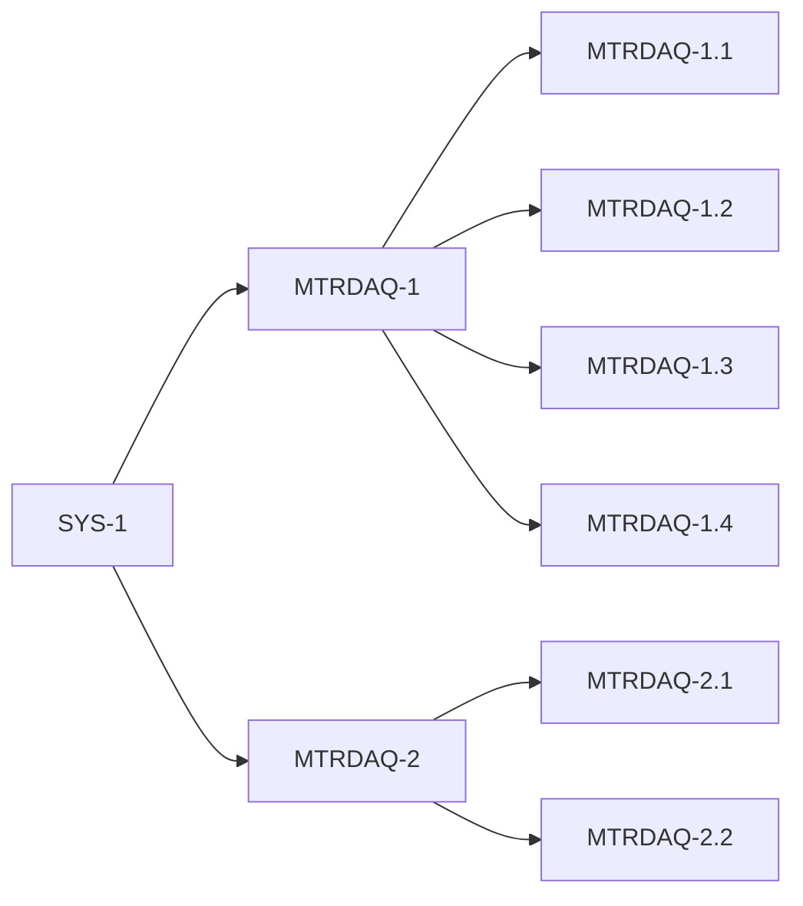

# Systems Engineering
{: .no_toc }

How we write requirements, pick parts, and review designs. Every board since 2025–26 (the
[BMS]({{ '/docs/projects/bms/' | relative_url }}#requirements), [payload board]({{ '/docs/projects/payload-board/' | relative_url }}#requirements),
[GYRO]({{ '/docs/projects/gyro/' | relative_url }}#requirements), and the [ground station]({{ '/docs/projects/wings/' | relative_url }}#requirements))
has gone through this, so it's worth knowing even if you never write a requirement yourself.
{: .fs-5 .fw-300 }

  
Contents

  {: .text-delta }
- TOC
{:toc}

Based on the old wiki's requirements and trade study tutorials, plus the way the 2025–26 boards were actually
documented.

## Requirements

A requirement says what the system has to do, in a way you can check later. The team's requirements template is
[this spreadsheet](https://docs.google.com/spreadsheets/d/1fVk-u3fFTXpNQ4kXZ9CVN_FCO6310NpClOHQDssDYcs/edit?gid=0#gid=0).
Each row has:

| Column | What goes in it |
|:--|:--|
| Requirement # | A unique ID, like `EPS-2.1` (see [below](#numbering)) |
| Requirement | One sentence with "shall" in it: "The power storage subsystem **shall** store 40 Wh of electrical power." |
| Rationale | Why it exists. "Required for powering the UFC for a period of 6 hours." |
| Parent / child requirements | The IDs above and below it |
| Method of verification | [Inspection, analysis, demonstration, or test](#verifying-requirements) |
| Requirement met? | Updated as the project goes. At a design review, most will still say "Not Met", and that's fine. |

The rationale is the column people skip, and it's the one the next person needs most. At the 2025–26 PDR a reviewer
asked why the BMS was sized for 4 hours of recovery, and the honest answer was that previous leads had said so. Write
down where your numbers come from.

### SMART requirements

Requirements should be **S**pecific, **M**easurable, **A**chievable, **R**elevant, and **T**raceable.

**Specific.** Say exactly what the requirement applies to (the whole system, a subsystem, one component) and what it
has to do.

- ❌ It shall operate correctly.
- ✅ The system shall operate with a mean time between failures of 900 hours.

**Measurable.** If you can't measure it, you can't verify it. Watch out for words like *quickly*, *good*, or *robust*.

- ❌ The system shall collect motor pressure quickly.
- ✅ The system shall measure motor pressure at a frequency of 500 Hz.

**Achievable.** A requirement you can't meet shouldn't exist. Watch for combinations: two requirements can each be
fine on their own and impossible together.

- ✅ EPS-1: The electrical power system shall weigh less than 1 kg.
- ✅ EPS-1.1: The electrical power storage subassembly shall store 200 Wh.
- ❌ Both at once. Lithium polymer cells top out around 140 Wh/kg, so even if the whole 1 kg is battery, you get about
  140 Wh.

**Relevant.** Requirements belong to the subsystem they're written for. Don't put the mechanical subsystem's mass limit
in the power system's requirements.

**Traceable.** Every requirement links up to the parent it helps satisfy and down to the children that satisfy it.
A parent is met when all of its children are.

### Numbering

IDs are a subsystem prefix and a number, with a dot for each level down. The prefixes we've used:

| Prefix | Subsystem |
|:--|:--|
| `SYS` | System level: the parents of the subsystem requirements |
| `CDH` | Command and data handling (flight computers) |
| `EPS` | Electrical power (batteries, BMS) |
| `PAYLD` | Payload |
| `GNDSTN` | Ground station |

So a tree for, say, a wireless motor pressure logger looks like this:

SYS-1 is met when MTRDAQ-1 and MTRDAQ-2 are met; MTRDAQ-1 is met when 1.1 through 1.4 are.

## Verifying requirements

Each requirement gets one verification method:

| Method | What it means | Example |
|:--|:--|:--|
| **Inspection** | Look at it. Check the design or the built thing. | EPS-3.3: the BMS talks to the UFC over CAN |
| **Analysis** | Show it with calculations or a model. | EPS-4: the pack charges in under 4 hours |
| **Demonstration** | Operate it and watch it do the thing, without detailed measurements. | PAYLD-2: the payload board works out its flight state |
| **Test** | Operate it under controlled conditions and measure the result against a pass/fail number. | EPS-2.1: discharge the pack and measure at least 40 Wh |

For 2026 the plans live in a verification matrix (`2026 System Requirements Verification Matrix.xlsx` in the team
Drive), one tab per system. A good plan says exactly what to set up, what to do, and what number counts as a pass.
The [BMS capacity test]({{ '/docs/projects/bms/testing/' | relative_url }}#verification-plan) is a good example.
"Write test plans with pass/fail criteria" was an action item for the environmental tests at the 2025–26 PDR, so this
is still a work in progress.

Near the end of the season the timeline has a **functional configuration audit (FCA)** and a **verification and
validation (V&V)** milestone. That's where the "Requirement met?" column gets filled in with evidence.

## Trade studies

A trade study is how you pick between options (parts, architectures, design choices) and leave a record of why. The
NASA Systems Engineering Handbook's definition is a mouthful; the short version is: list what matters, weight it,
score every option the same way, and add it up.

The team's template is [this spreadsheet](https://docs.google.com/spreadsheets/d/1DZZNgTP6iAYz3JNk8SiITwpT2VR6S7-8nERe-11uSDI/edit?gid=0#gid=0).
Start with the requirements the choice is meant to satisfy. If you're replacing an existing part, make it the
**baseline** and compare the alternatives to it.

1. **Criteria.** The measurable things you're comparing: cost, accuracy, power, mass, ease of integration, flight
   heritage, and so on. Every option is judged on the same criteria.
2. **Rationale.** For each criterion, why it matters, tied back to a requirement. For a pressure sensor's accuracy
   criterion, that's the requirement for measurement accuracy, plus a sentence on why.
3. **Weights.** How much you care about each criterion. They add up to 100%. Mass matters a lot if you're counting
   grams, and hardly at all if every option weighs about the same.
4. **Scale.** How a datasheet number turns into a score, so every option is graded the same way. The template uses
   0.00 to 1.00 in 0.05 steps. More precision than that is just noise.
5. **Score** each option on each criterion using the scale.
6. **Add it up.** Each option gets a weighted total, as a percentage.

How to read the total, per the old guide:

| Score | Meaning |
|:--|:--|
| Above 85% | A good option |
| 50–85% | Meets our needs, but nothing to phone home about |
| 30–65% | Will probably do the thing? |
| Below 30% | The "guys, we might be cooked" zone. What we want might not exist. |

{: .check }
The old guide's bands overlap (50–65% is in two of them), and its scoring example gives a 3% accuracy sensor a higher
score (0.6) than a 2.5% one (0.5), which is backwards if a lower percentage is better. The idea is right; check your
scale runs the right way before you trust the totals.

**Pass/fail criteria.** Some requirements aren't a matter of degree. The [UFC 3.5 radio trade study]({{ '/docs/projects/ufc/cards/primary-card/' | relative_url }}#radio-trade-study-2026)
had "works at 433 MHz" as pass/fail: the RFD900ux had the best data rate of the lot and was out anyway.

**Weighting by pairwise comparison.** Picking weights directly is hard to do honestly. For the
[BMS IC]({{ '/docs/projects/bms/' | relative_url }}#trade-studies), four people each compared every criterion against
every other one ("is thermal protection more important than cost?"), and the results were averaged into weights. Thermal and overcurrent protection
came out on top; cost and pin count at the bottom.

A nice side effect of a trade study: when your first choice turns out to be out of stock or broken, the runner-up is
already there. (The BMS ended up with its runner-up IC, the MAX17320, rather than the BQ40Z50 it picked at review.) Also, people who do
this for a living (NASA, launch companies) do it the same way, so it's a good thing to be able to talk about in an
interview.

## Design reviews

A design review is a meeting where other people try to find what's wrong with your design before you spend money on
it. We have a few kinds:

| Review | When | What's reviewed |
|:--|:--|:--|
| **Conceptual design review (CoDR)** | Start of a new board | Concept, block diagram, trade studies. The BMS had one in [August 2025]({{ '/docs/projects/bms/' | relative_url }}#design-review-august-2025). |
| **Schematic review** | Schematic done | The schematic, by the rest of avionics, before layout |
| **Board review** | Layout done | The PCB, before ordering. [Checklist]({{ '/docs/tutorials/hardware/design-practices/' | relative_url }}#final-layout-checklist). |
| **CAD review** | Structure designed | How the board mounts and integrates |
| **Preliminary design review (PDR)** | Every December | Everything, in front of alumni, industry engineers, and other teams |

The schematic, board, and CAD reviews are the gates in the [board design cycle]({{ '/docs/tutorials/hardware/design-practices/' | relative_url }}#design-process).
The PDR is the big one. Past PDRs, and what came out of them, are on
[UFC Design History]({{ '/docs/projects/ufc/design-history/' | relative_url }}#design-reviews).

What makes a review useful, going by past PDRs:

- **Send the design document out beforehand.** The PDRs have had a written design document that goes out before the
  meeting, so reviewers arrive with questions.
- **Take notes on every question, including the ones you couldn't answer.** "We haven't compared those yet, we should do
  that" is a perfectly good answer, as long as it turns into an action item.
- **Track the action items.** Since 2025 the PDR has had an action item sheet: the feedback, which project it's for, the
  plan, who's responsible, and whether it's done. That's how you can tell, months later, why the payload board's fuse
  was resized ([payload board]({{ '/docs/projects/payload-board/' | relative_url }}#changes-after-the-pdr)).
